# Security+ Lab 1.1 - Security Controls

**CompTIA Security+ SY0-701 - Domain 1: General Security Concepts - Objective 1.1**

This report documents the configuration and validation of technical controls on Ubuntu Server and Kali Linux. Each section states its objective, explains every step with its screenshot and command or action, and ends with the key learning takeaway.

## Lab Overview

- **Ubuntu server:** 172.16.40.20
- **Kali client authorized for HTTP:** 172.16.40.104
- **Kali client used for the negative test:** 172.16.40.105
- **Services and controls:** Nginx, UFW, and OpenSSH
- **Result:** UFW blocked HTTP when no allow rule was present, logged blocked attempts, and then restricted HTTP access to a specific source address. An SSH banner was also configured, and an Nginx configuration was restored after a controlled failure.

The screenshots show the addresses used in the lab; by themselves, they do not prove network isolation.

## 1. Nginx and HTTP Baseline

**Objective:** confirm that the web server is working and Kali can reach it before changing the firewall. This baseline provides a point of comparison for later results.

### Step 1.1 - Check the Nginx service

On Ubuntu, check the service status before making network changes.

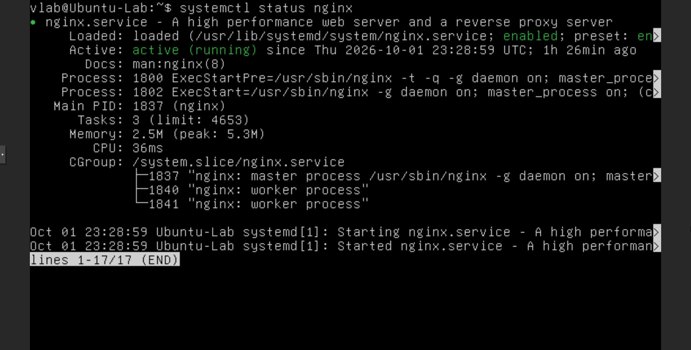

**Command:**

```bash
systemctl status nginx
```

This command queries systemd and shows whether Nginx is loaded and active, along with recent service information. The screenshot shows the status active (running).

### Step 1.2 - Check HTTP from Kali

In the Kali browser, open the Ubuntu server and confirm that the default Nginx page appears.

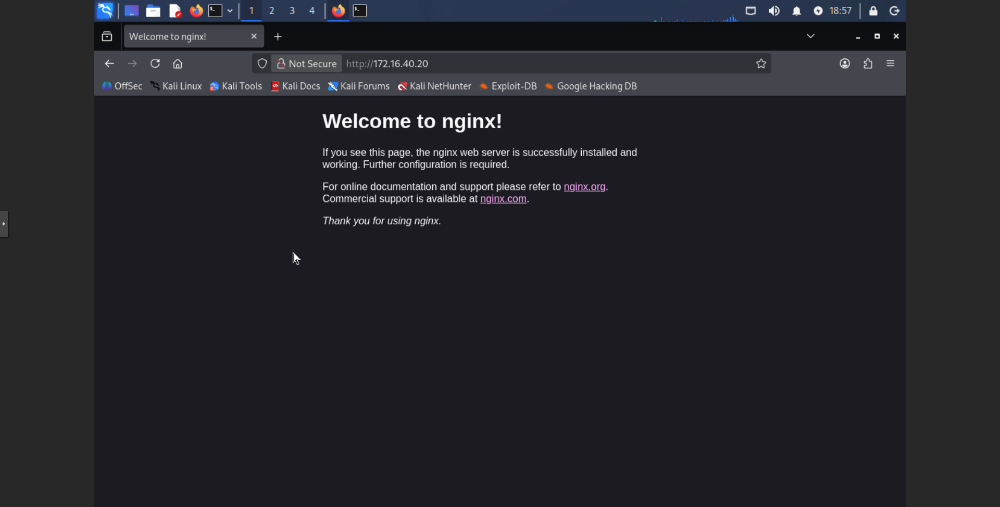

**Action:** open http://172.16.40.20 in the browser.

This confirms that the client can reach the HTTP service and receive a response from Nginx before UFW's restrictive policy is enabled.

This section establishes a baseline before changing controls. If HTTP fails later, this result can help determine whether the firewall, service, or connectivity changed.

## 2. UFW Default Policy and HTTP Blocking

**Objective:** enable a host firewall with a restrictive inbound policy, preserve administrative SSH access, and observe what happens when HTTP is attempted without an explicit allow rule.

### Preparation - Preserve SSH administration

Before enabling UFW, allow OpenSSH to avoid losing the remote administration session when inbound traffic is restricted.

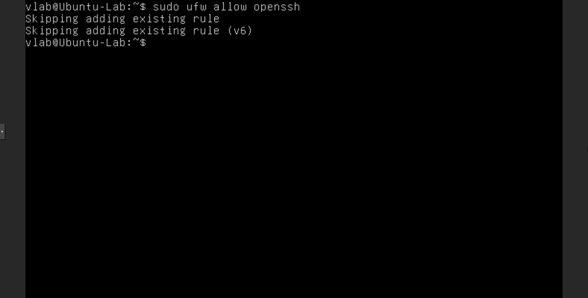

**Command:**

```bash
sudo ufw allow openssh
```

This command asks UFW to allow connections to the OpenSSH service. The screenshot shows UFW skipping the rule because it already exists for both IPv4 and IPv6, preserving administrative access without adding duplicate rules.

### Step 2.1 - Deny incoming connections by default

Change UFW's default policy to reject incoming connections that are not authorized by a rule.

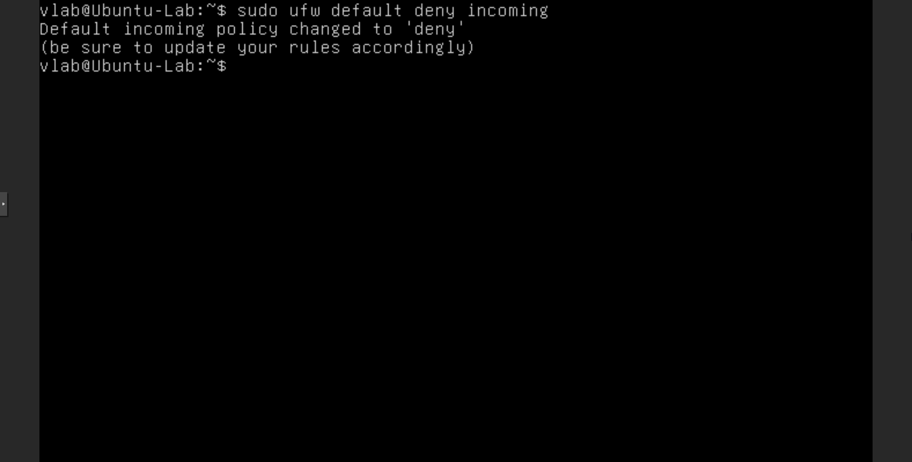

**Command:**

```bash
sudo ufw default deny incoming
```

This command sets UFW's default behavior for incoming traffic to deny. Explicitly allowed rules remain exceptions.

### Step 2.2 - Allow outgoing connections by default

Keep connections initiated from Ubuntu to other destinations allowed.

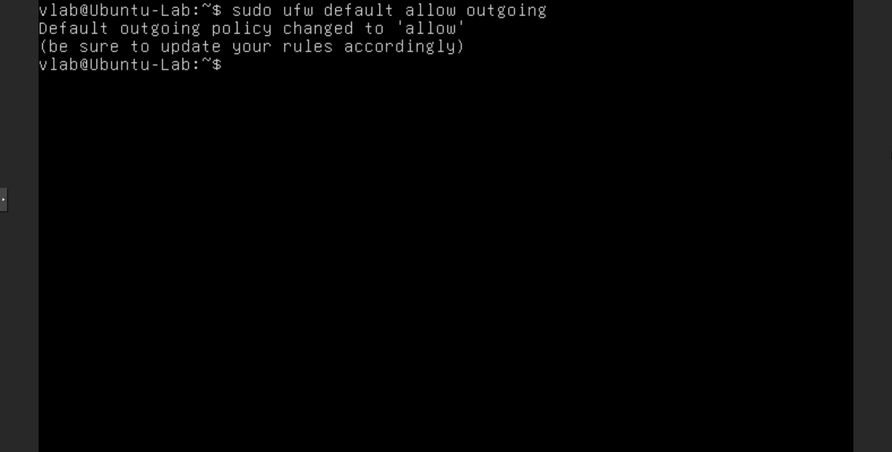

**Command:**

```bash
sudo ufw default allow outgoing
```

This command configures UFW to allow outgoing traffic by default. This policy is independent of the incoming policy.

### Step 2.3 - Enable UFW

Enable the firewall with the configured policies and rules.

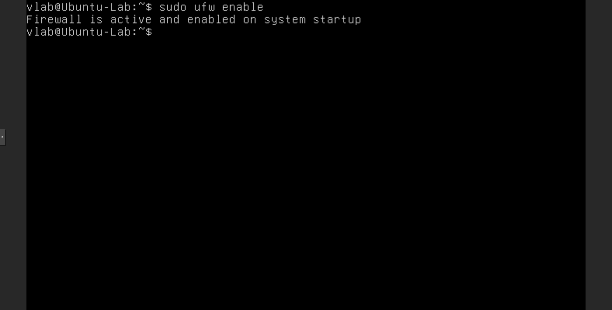

**Command:**

```bash
sudo ufw enable
```

This command enables UFW and its rules. The displayed message confirms that the firewall will also be enabled at system startup.

### Step 2.4 - Check the initial status and rules

Confirm that UFW is active, OpenSSH is still allowed, and TCP/80 does not yet have an allow rule.

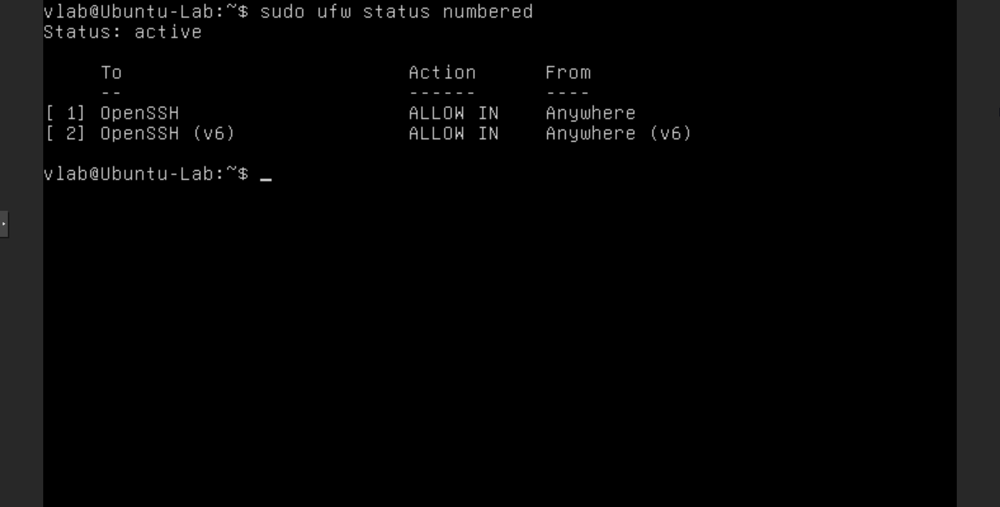

**Command:**

```bash
sudo ufw status numbered
```

This command displays the firewall status and numbers the rules in effect. The screenshot shows OpenSSH allowed; TCP/80 is not listed.

### Step 2.5 - Test HTTP without an allow rule

From Kali, open the Ubuntu server over HTTP again and observe that the connection times out.

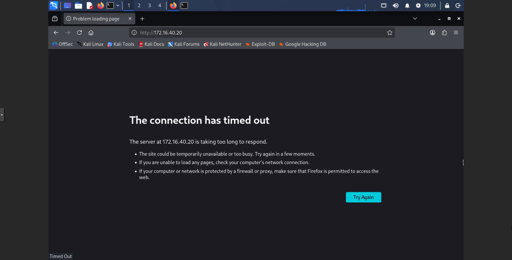

**Action:** try to open http://172.16.40.20 in the browser.

A browser timeout alone does not establish that UFW blocked the request; a stopped service or another connectivity issue can produce the same symptom. In this test, the Nginx baseline was active and UFW had no TCP/80 allow rule, which supports the firewall-block conclusion. The UFW BLOCK records in Section 4 provide corroborating evidence.

This section shows how a default-deny policy reduces incoming connections and requires explicit exceptions. Allowing OpenSSH before enabling UFW preserves administration; leaving HTTP disallowed makes it possible to test the control over the web service.

## 3. General HTTP Allow Rule

**Objective:** add an exception for TCP/80 and compare the result with the previous negative test.

### Step 3.1 - Allow TCP/80

Add a general rule to UFW that allows incoming HTTP traffic.

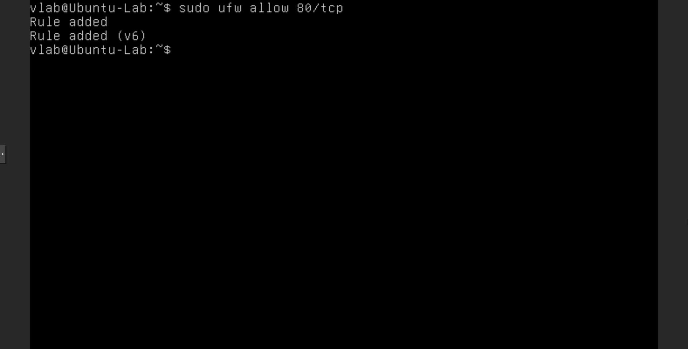

**Command:**

```bash
sudo ufw allow 80/tcp
```

This command adds a rule allowing incoming connections to port 80 over TCP. The output shows rules added for IPv4 and IPv6.

### Step 3.2 - Confirm the rule

Verify that the new rule appears in the active configuration.

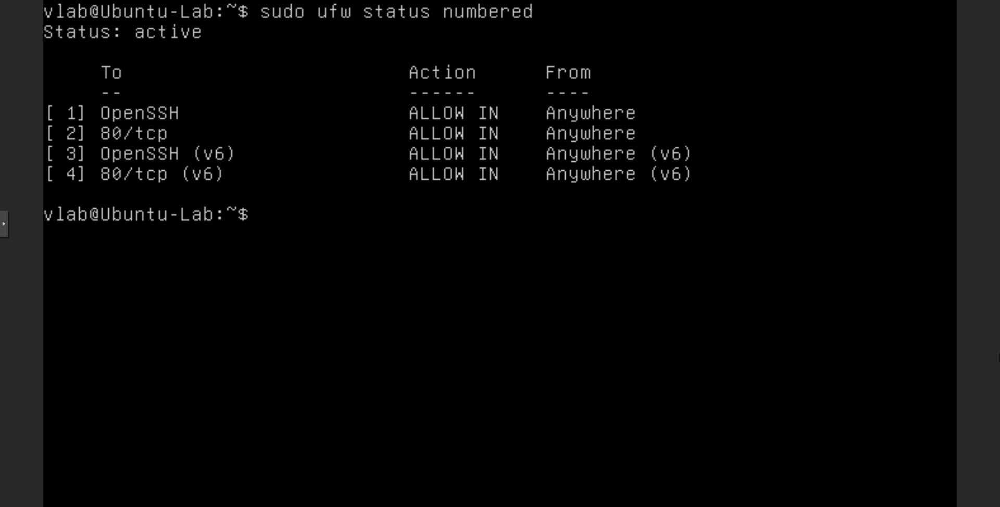

**Command:**

```bash
sudo ufw status numbered
```

This command lists the active rules. The screenshot shows TCP/80 allowed in addition to OpenSSH.

### Step 3.3 - Test HTTP with the general allow rule

From Kali, reload the Ubuntu page over HTTP.

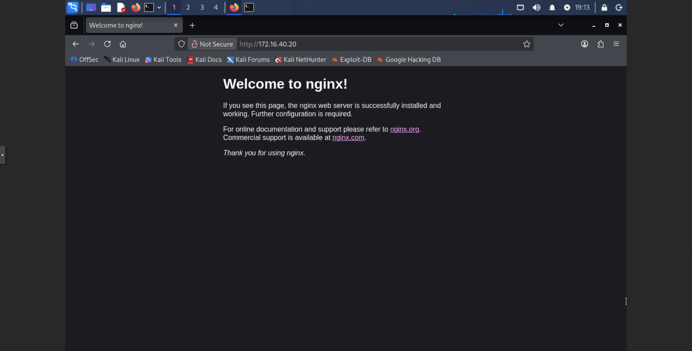

**Action:** open http://172.16.40.20 in the browser.

The page loads when UFW allows TCP/80. Comparing this result with Figure 7 demonstrates the behavior change associated with the rule.

The positive and negative tests show the effect of the rule. The general TCP/80 exception grants access to any source that can reach the server; a source-specific rule is applied later to limit access to the required client.

## 4. UFW Logging and First Removal of the HTTP Allow Rule

**Objective:** enable logging, block HTTP again, and use the events to observe and investigate rejected traffic. This is the first removal of the general allow rule; it is restored later to continue the lab.

### Step 4.1 - Enable logging

Enable UFW logging before generating traffic that will be blocked.

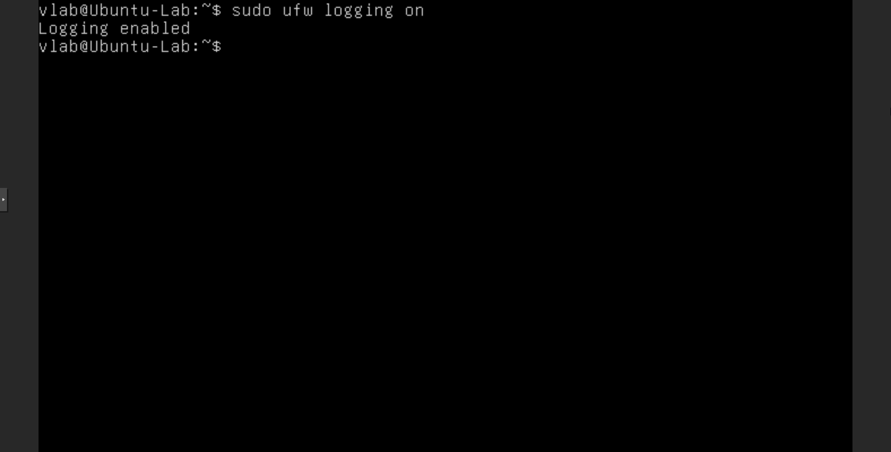

**Command:**

```bash
sudo ufw logging on
```

This command enables firewall event logging, including attempts that UFW blocks.

### Step 4.2 - Temporarily remove the general HTTP rule

Remove the general TCP/80 allow rule so the next attempt from Kali will be blocked and can appear in the logs.

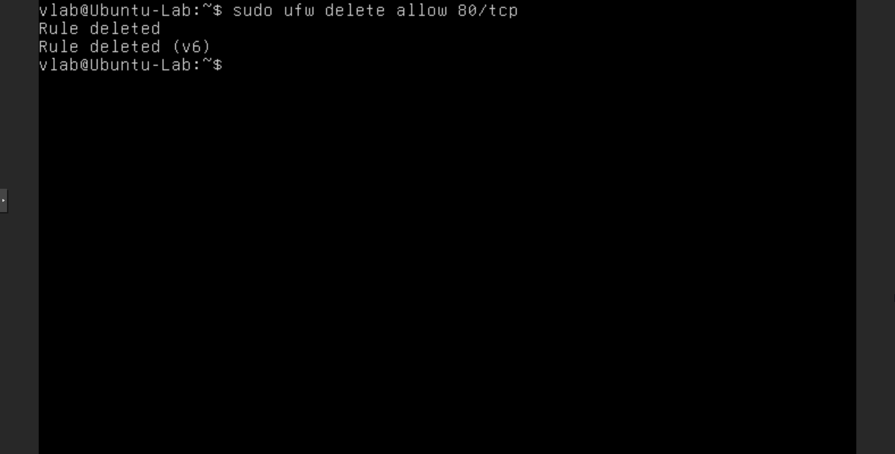

**Command:**

```bash
sudo ufw delete allow 80/tcp
```

This command removes the general rule that allowed TCP/80. The output shows that the IPv4 and IPv6 rules were removed.

### Step 4.3 - Generate blocked HTTP traffic

From Kali, try to load the server again while no rule allows TCP/80.

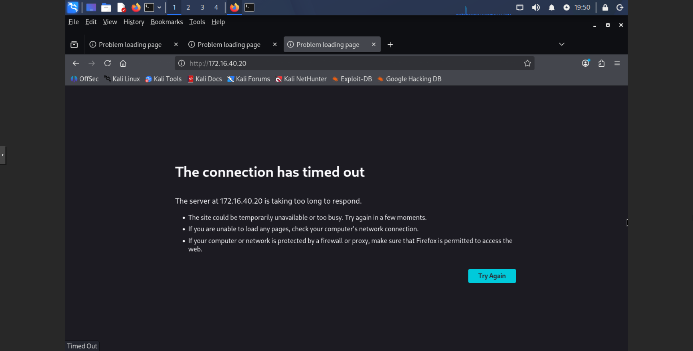

**Action:** try to open http://172.16.40.20 in the browser.

The browser times out after the general allow rule is removed. A timeout alone does not identify the cause; in this test, the active Nginx baseline and UFW policy support a firewall-block conclusion. The following log checks provide corroborating evidence.

### Step 4.4 - Check kernel events

On Ubuntu, filter kernel events related to UFW blocks.

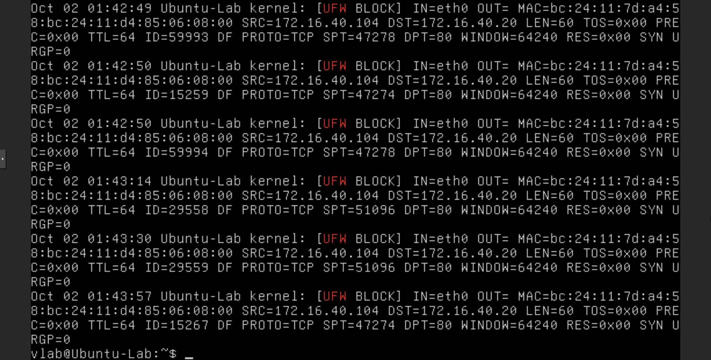

**Command:**

```bash
sudo journalctl -k | grep 'UFW BLOCK'
```

`journalctl -k` retrieves kernel messages, and `grep` selects UFW block records. The screenshot shows SRC=172.16.40.104 (source), DST=172.16.40.20 (destination), PROTO=TCP, and DPT=80 (destination port), consistent with a TCP connection attempt from Kali to the Ubuntu HTTP service.

### Step 4.5 - Check ufw.log

Review the latest entries in the UFW log file.

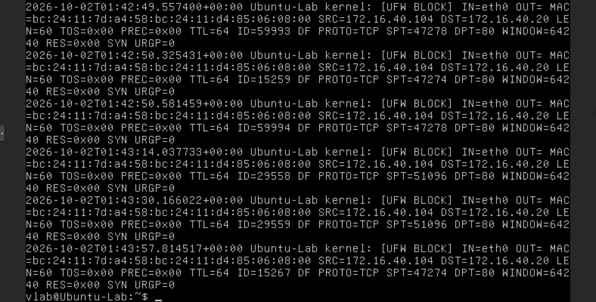

**Command:**

```bash
sudo tail -n 30 /var/log/ufw.log
```

The displayed entries in `/var/log/ufw.log` include UFW BLOCK records for TCP traffic to destination port 80 from 172.16.40.104, corroborating the kernel journal output.

### Step 4.6 - Restore the general allow rule to continue

Allow HTTP again after reviewing the logs.

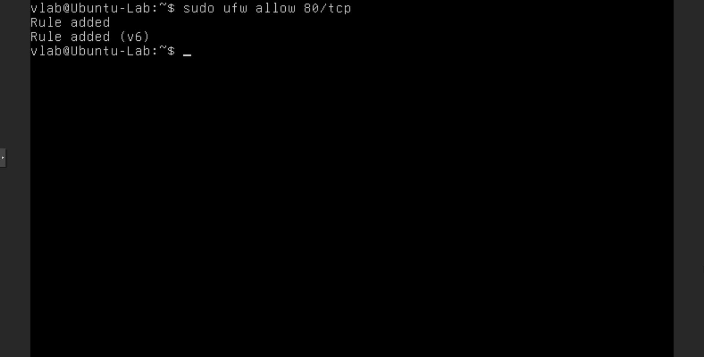

**Command:**

```bash
sudo ufw allow 80/tcp
```

This command adds the general allow rule for TCP/80 again, for IPv4 and IPv6.

### Step 4.7 - Confirm HTTP has been restored

From Kali, load the server once more to confirm that access has been restored.

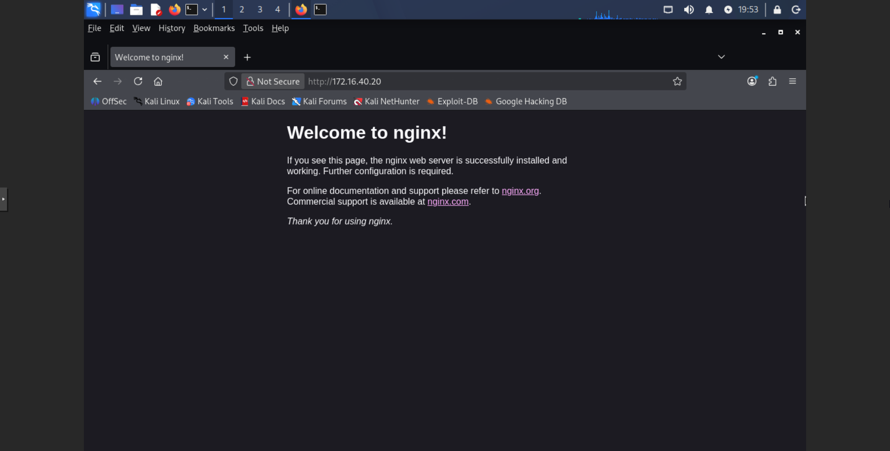

**Action:** open http://172.16.40.20 in the browser.

The Nginx page responds again after the general rule is restored, confirming the observed change in client access.

This section shows the difference between prevention and detection: UFW blocks the traffic, while its logs provide evidence to investigate the attempt. Logs do not replace the blocking rule. The general allow rule is enabled again here so the following tests can continue.

## 5. SSH Warning Banner

**Objective:** configure an authorized-use message and verify that OpenSSH presents it to the client before requesting a password.

### Step 5.1 - Write the banner text

Edit the text file that will contain the notice.

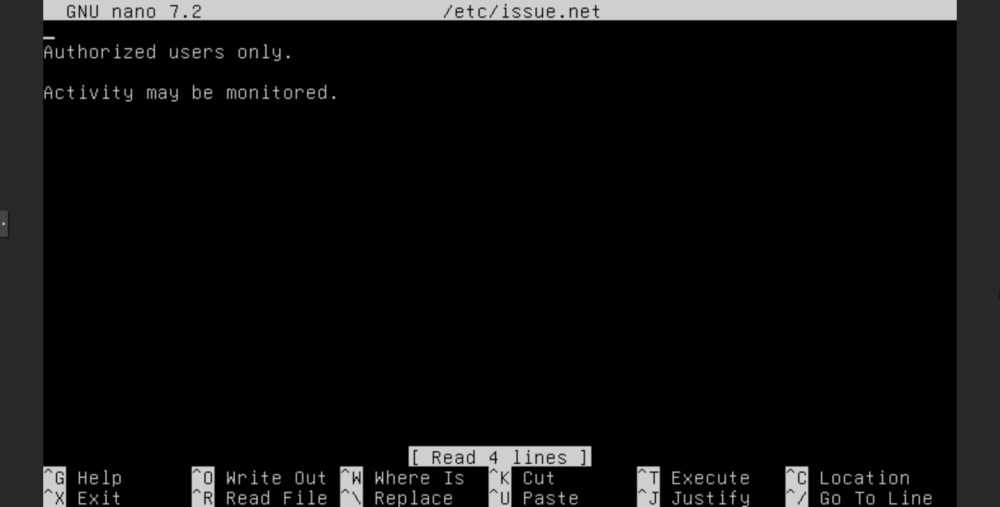

**Command:**

```bash
sudo nano /etc/issue.net
```

The authorized-use and monitoring notice is stored in `/etc/issue.net`, the file referenced by the SSH banner configuration in the next step.

### Step 5.2 - Configure OpenSSH to display the banner

Edit the SSH server configuration and set the path to the notice file.

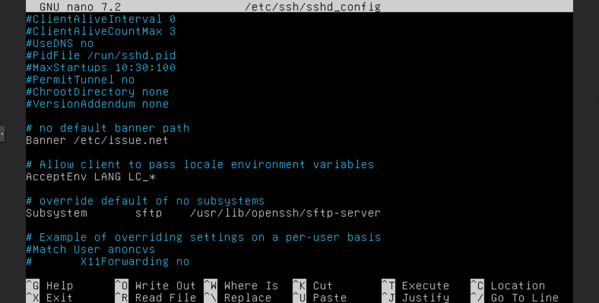

**Command:**

```bash
sudo nano /etc/ssh/sshd_config
```

The `Banner /etc/issue.net` directive configures OpenSSH to present the notice created in Step 5.1 when a connection begins.

### Step 5.3 - Validate and restart SSH

First validate the configuration syntax and, if there are no errors, restart the service to apply the change.

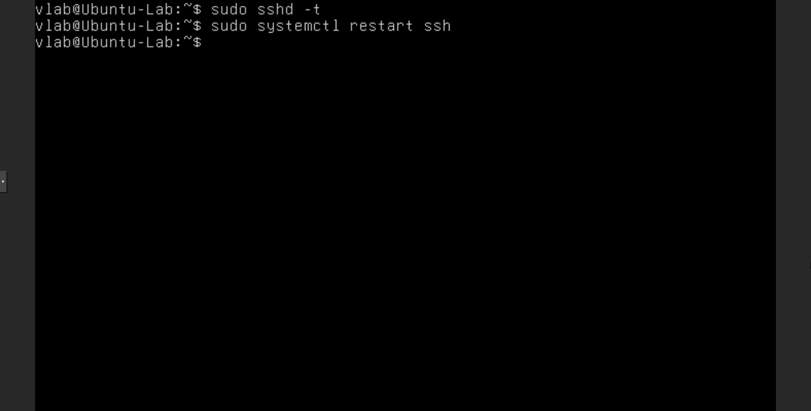

**Commands:**

```bash
sudo sshd -t
sudo systemctl restart ssh
```

`sshd -t` validates the daemon configuration before the service is restarted. The screenshot shows no validation error before `systemctl restart ssh` is run to load the banner setting.

### Step 5.4 - View the banner from Kali

Start an SSH connection from Kali and confirm that the notice appears before the password prompt.

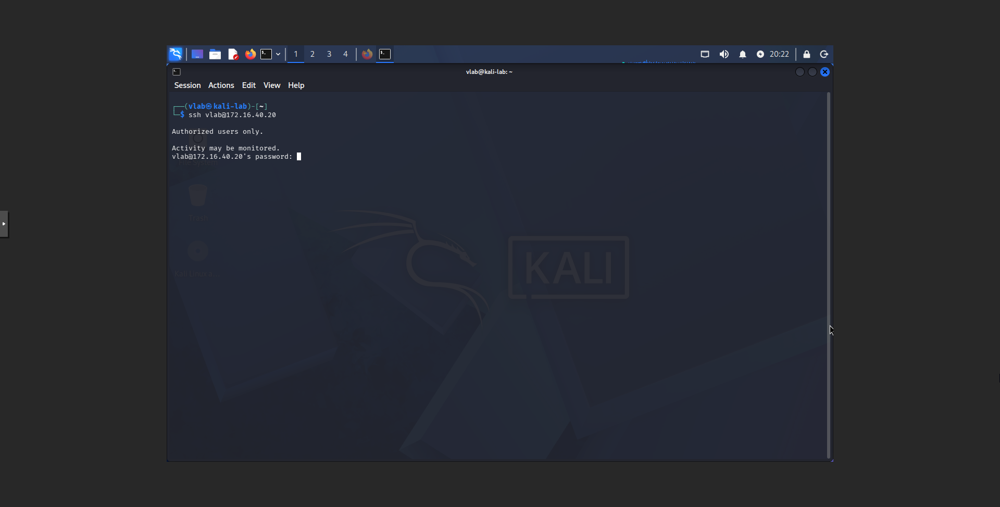

**Command:**

```bash
ssh vlab@172.16.40.20
```

This command requests an SSH connection to user vlab on server 172.16.40.20. The screenshot shows the banner and the password prompt; it does not show a completed authentication.

The displayed notice has a Directive function because it communicates authorized-use conditions and may serve a Deterrent function by discouraging unauthorized access. The screenshot confirms that the banner appeared before the password prompt; it does not demonstrate successful authentication.

## 6. Restrict HTTP by Source Address

**Objective:** replace the general HTTP allow rule with a rule that permits TCP/80 only from the authorized client, then verify the behavior with a positive and a negative test.

### Step 6.1 - Remove the general allow rule again

Remove the general TCP/80 rule again before creating the rule restricted to .104. This is a second deliberate execution: after the first removal for logging, the general allow rule was restored in Figure 16.


**Command:**

```bash
sudo ufw delete allow 80/tcp
```

This command removes the general TCP/80 allow rules for IPv4 and IPv6. This removal prepares UFW for an allow rule restricted by source address.

### Step 6.2 - Allow HTTP from the authorized client

Create a rule to accept HTTP from 172.16.40.104.

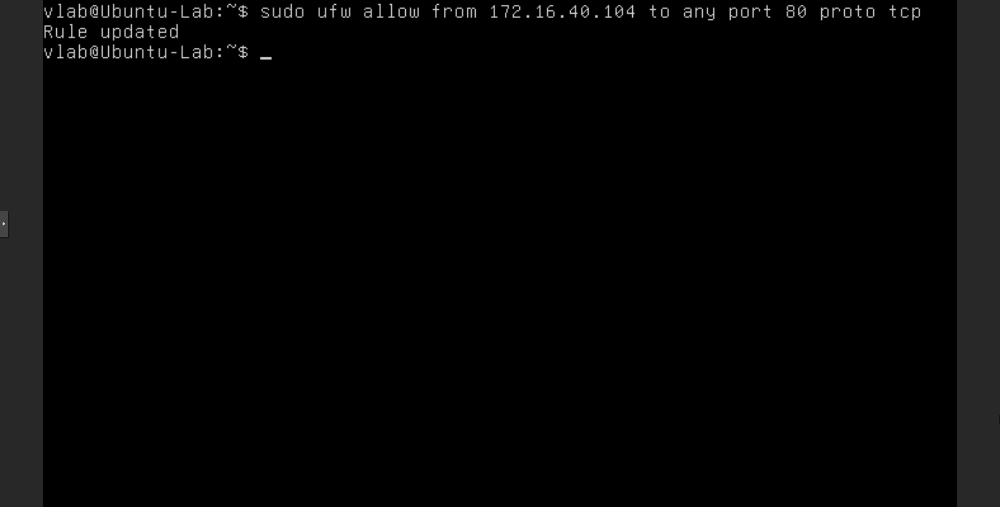

**Command:**

```bash
sudo ufw allow from 172.16.40.104 to any port 80 proto tcp
```

This command allows TCP connections to port 80 when the source is 172.16.40.104. It does not create a general rule for any source address.

### Step 6.3 - Verify the source-specific allow rule

Review the active rules and confirm that the HTTP allow rule is associated with .104.

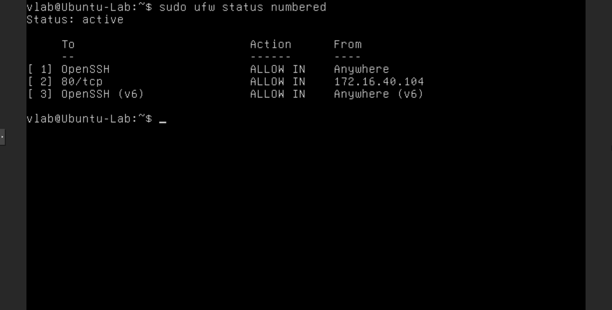

**Command:**

```bash
sudo ufw status numbered
```

This command lists the active rules. The screenshot shows 80/tcp allowed from 172.16.40.104; OpenSSH remains allowed from Anywhere for both IPv4 and IPv6.

### Step 6.4 - Test from the authorized client

From Kali at 172.16.40.104, open the web server.

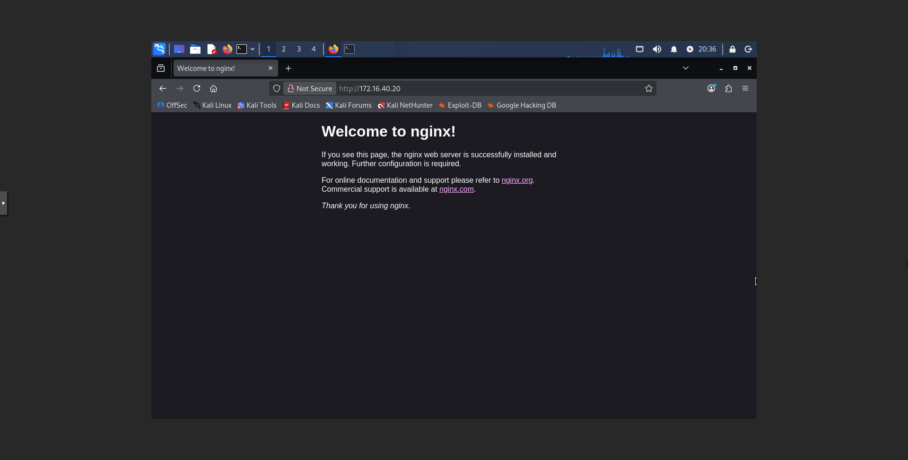

**Action:** open http://172.16.40.20 in the browser from client .104.

The authorized source, 172.16.40.104, loads the Nginx page, providing the positive case. Restricting HTTP to the required source applies least privilege at the network-access layer.

### Step 6.5 - Test from an unauthorized client

Confirm the second Kali machine's address, then try to access HTTP from .105.

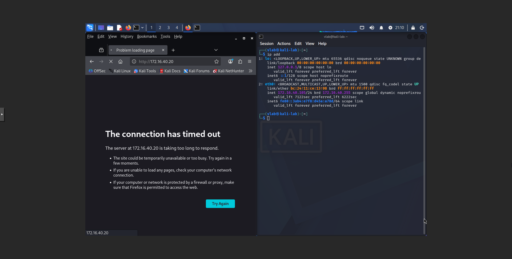

**Command:**

```bash
ip add
```

The screenshot shows the executed `ip add` command and identifies the client as 172.16.40.105/24; the browser times out when connecting to http://172.16.40.20. Paired with the successful .104 test and the active UFW source rule, this supports source-based filtering as the explanation for the different outcomes. The timeout alone would not establish that conclusion.

The active source-specific rule, successful access from .104, and timeout from .105 support the conclusion that UFW enforces the allowlist. This is a Technical, Preventive control that limits HTTP access to the required source. It is a Compensating control only under the lab scenario in which a legacy service cannot be patched immediately and network restriction is used temporarily to reduce exposure. The screenshots do not prove that Nginx is vulnerable or that a patch is missing.

## 7. Nginx Backup and Recovery

**Objective:** back up the known configuration, introduce a controlled failure, detect it before reloading, restore the file, and verify that Nginx is operational again.

### Step 7.1 - Create a backup

Copy the default Nginx site configuration and check that both the original file and the backup are present.

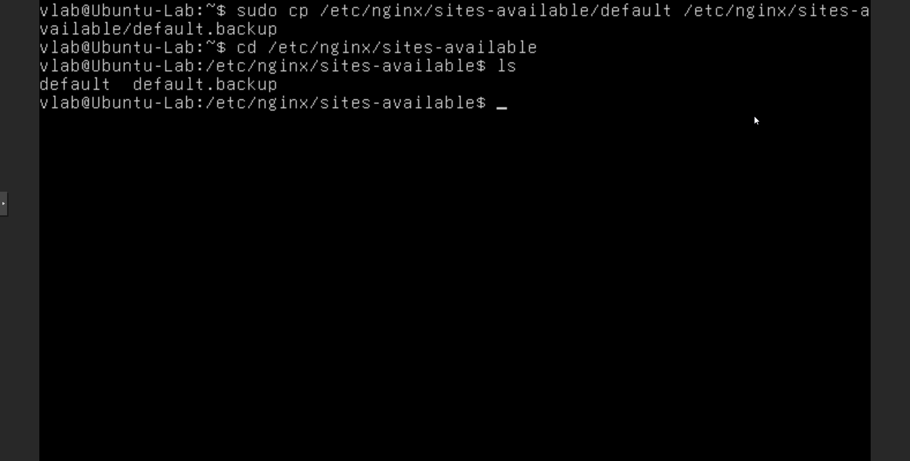

**Commands:**

```bash
sudo cp /etc/nginx/sites-available/default /etc/nginx/sites-available/default.backup
cd /etc/nginx/sites-available
ls
```

A known-good copy of the site configuration is created before the controlled change. The directory listing verifies that both `default` and `default.backup` are present before proceeding.

### Step 7.2 - Introduce and detect the controlled failure

Rename the file expected by the sites-enabled link and run the configuration test. Nginx is not reloaded while validation fails.

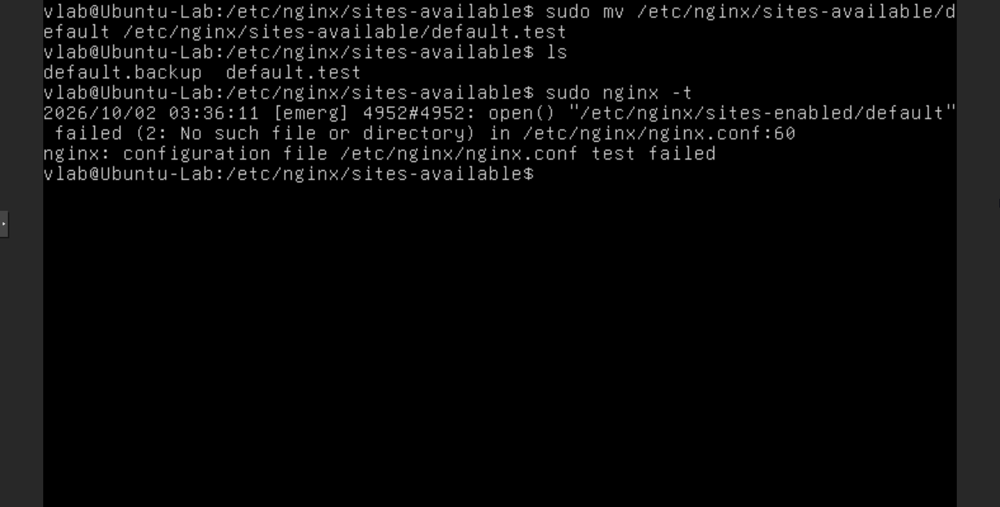

**Commands:**

```bash
sudo mv /etc/nginx/sites-available/default /etc/nginx/sites-available/default.test
ls
sudo nginx -t
```

The active site configuration is intentionally renamed, breaking the expected `/etc/nginx/sites-enabled/default` reference. The screenshot shows `nginx -t` detecting the missing target before an invalid configuration can be reloaded.

### Step 7.3 - Restore the file and validate

Copy the backup back to its expected name and repeat the validation before applying changes to the service.

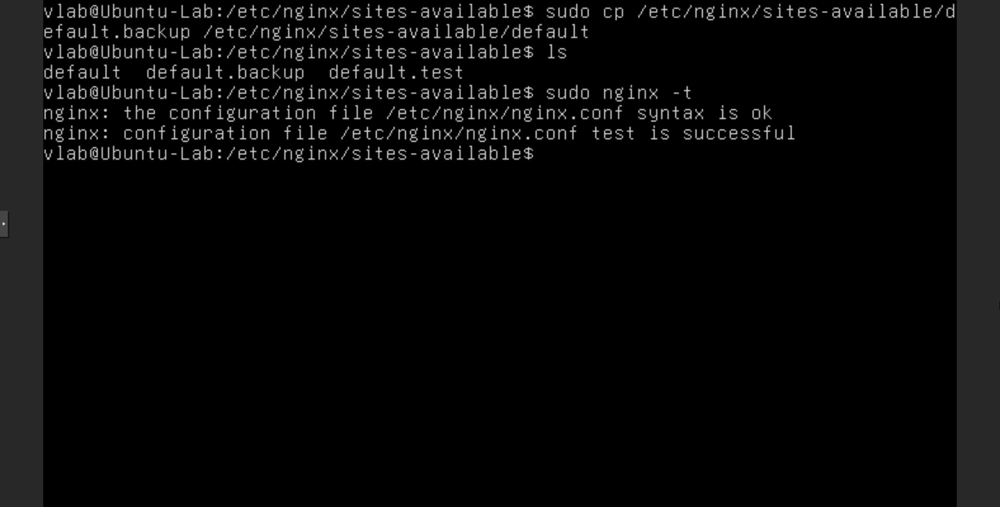

**Commands:**

```bash
sudo cp /etc/nginx/sites-available/default.backup /etc/nginx/sites-available/default
ls
sudo nginx -t
```

The backup is copied back to the expected `default` path, restoring the target referenced through `sites-enabled`. The directory listing is checked and `nginx -t` is rerun; its successful result confirms that the restored configuration validates before reload.

### Step 7.4 - Reload Nginx after validation

Apply the restored configuration only after nginx -t succeeds.

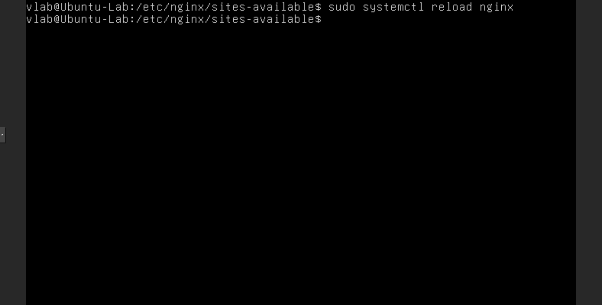

**Command:**

```bash
sudo systemctl reload nginx
```

This command asks systemd to reload the Nginx configuration without stopping the service completely.

### Step 7.5 - Confirm the final status

Check that Nginx remains active after recovery and reload.

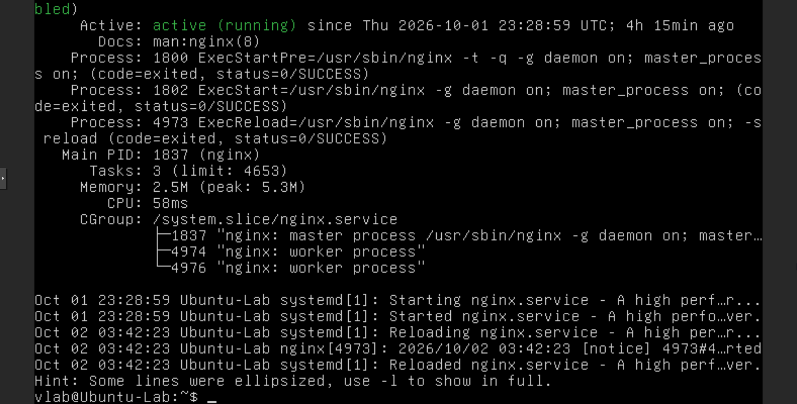

**Command:**

```bash
systemctl status nginx
```

This command shows the current service status and recent events. The screenshot confirms active (running) and shows that the reload completed successfully.

This section shows the value of backing up and validating before applying changes. nginx -t detected the issue before reload; after the file was restored, validation passed. The observed sequence was backup -> controlled change -> failed validation -> restoration -> successful validation -> reload -> service check.

## Control Classification

| Action | Category | Observed or contextual function |
|---|---|---|
| UFW rules to block or allow HTTP | Technical | Preventive |
| UFW events in the journal and ufw.log | Technical | Detective |
| OpenSSH banner | Technical | Directive; may have a deterrent effect |
| HTTP rule restricted to .104 | Technical | Preventive; Compensating only under the stated lab scenario |
| Nginx configuration restoration | Technical | Corrective |

The lab documents host firewall configuration, positive and negative access testing, firewall log analysis, SSH banner configuration, and web service recovery. The evidence covers Technical controls; it does not establish Managerial, Operational, or Physical controls.

## Observed Final State

- UFW remains active.
- HTTP is allowed from 172.16.40.104 on TCP/80; the test from .105 times out.
- OpenSSH is shown as allowed from Anywhere for IPv4 and IPv6 in the UFW status screenshot.
- The banner appears before the password prompt; successful authentication was not documented.
- Nginx passes validation after the configuration is restored and is shown as active after the reload.

## Portfolio Summary

Hands-on Security+ SY0-701 lab on technical controls in Linux: UFW configuration, firewall event analysis, source-based HTTP restriction, SSH warning banner, and Nginx recovery. Results were validated through rule status, tests from two client addresses, system logs, nginx -t, and the final service status.
