# Security+ Lab 1.2 - Fundamental Security Concepts

**CompTIA Security+ SY0-701 - Domain 1: General Security Concepts - Objective 1.2**

This report documents a hands-on exercise covering file integrity verification, Linux identities and group-based authorization, authentication and accounting evidence, and auditd monitoring of a decoy file.

## Lab Overview

- **Windows host:** PowerShell; integrity test file at `C:\SecPlus-Labs\documento.txt`.
- **Linux system:** Ubuntu lab VM.
- **Accounts and group:** `analyst`, `guestlab`, and the `secplus` group.
- **Access-controlled file:** `/srv/secplus/register.txt`, owned by `root:secplus` with mode `640`.
- **Honeyfile:** `/srv/shared/Admin_Credentials.txt`, containing fabricated text and configured with mode `644` for the controlled access test.
- **Tools and services:** PowerShell `Get-FileHash`, Linux user and group utilities, Unix file permissions, `journalctl`, `/var/log/auth.log`, `auditd`, `auditctl`, and `ausearch`.
- **Result:** the SHA-256 digest changed after the test file was edited; `analyst` could read the group-controlled file while `guestlab` was denied; authentication logs recorded the account switches; and auditd recorded `guestlab` reading the decoy honeyfile. A persistent audit-rule file was written, but loading it from disk and validating it after a reboot were not documented.

The evidence documents activity on the Windows host and Ubuntu lab VM. It does not include network addresses or prove behavior outside these systems.

## 1. File Integrity with SHA-256

**Objective:** establish a baseline digest for a test file, change its content, and compare the resulting SHA-256 digest to observe how the file's integrity state is reflected in the hash.

### Step 1.1 - Create the Windows lab workspace

Create a dedicated directory for the file used in the integrity check.

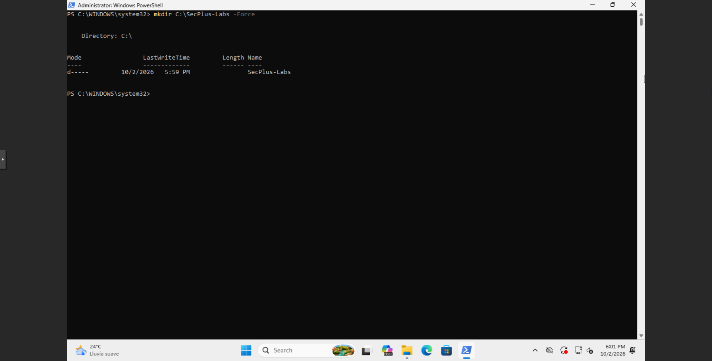

**Command:**

```powershell
mkdir C:\SecPlus-Labs -Force
```

The screenshot shows the `C:\SecPlus-Labs` directory created on the Windows host for the test file.

### Step 1.2 - Create the initial test file

Move to the lab directory and write the initial text to `documento.txt`.

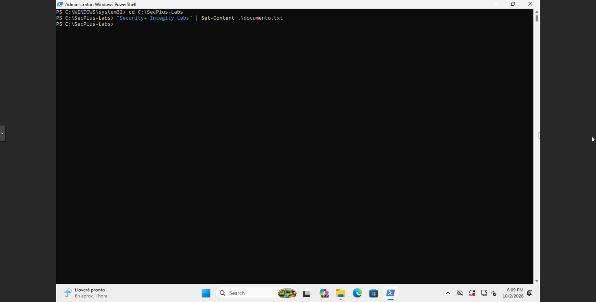

**Commands:**

```powershell
cd C:\SecPlus-Labs
"Security+ Integrity Labs" | Set-Content .\documento.txt
```

The resulting file provides known content for the first hash calculation. The test uses non-sensitive sample text.

### Step 1.3 - Compare the digest before and after an edit

Calculate the SHA-256 digest, replace the file content, and calculate the digest again.

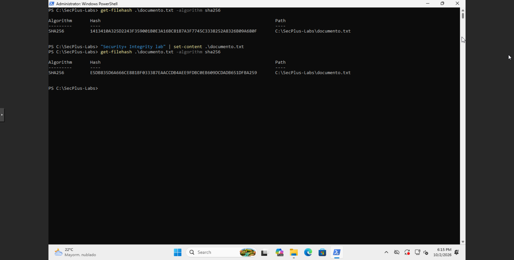

**Commands:**

```powershell
get-filehash .\documento.txt -algorithm sha256
"Security+ Integrity lab" | set-content .\documento.txt
get-filehash .\documento.txt -algorithm sha256
```

The screenshot shows different digest values before and after `Set-Content` changes the file. This supports the conclusion that the content changed. A hash can be used to check integrity against a known value, but a hash alone does not identify the author or prove the file's origin.

This section demonstrates integrity verification by comparing a file's digest across a controlled change. A changed digest signals changed content; it does not establish who created or sent the file.

## 2. Linux Identities and Group-Based File Authorization

**Objective:** create two test accounts, grant one account membership in a dedicated group, and verify how Linux file ownership and mode bits allow or deny access.

### Step 2.1 - Create the `secplus` group

Create the group that will be assigned to the protected file and verify that it is registered on Ubuntu.

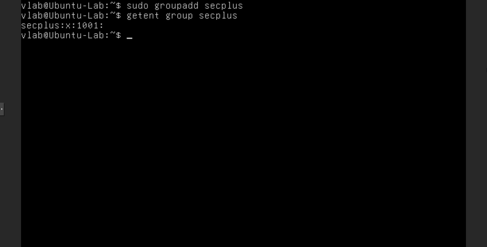

**Commands:**

```bash
sudo groupadd secplus
getent group secplus
```

The `getent` result shows the `secplus` group with GID `1001`, confirming that the group was created in this VM.

### Step 2.2 - Create the analyst account

Create the account that will receive group-based access to the test file.


**Command:**

```bash
sudo adduser analyst
```

The screenshot shows the account and its user-private group being created, followed by a successful password update. No password value is documented.

### Step 2.3 - Create the guest account

Create a separate account to use as the access-denied test case.

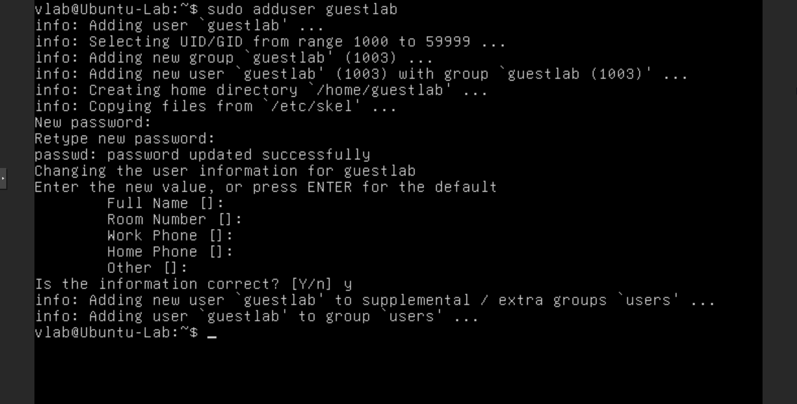

**Command:**

```bash
sudo adduser guestlab
```

The screenshot shows `guestlab` created as a separate account. It is not added to `secplus` in the later membership check.

### Step 2.4 - Add `analyst` to `secplus` and verify membership

Add `analyst` to the group and compare the group membership of both test accounts.

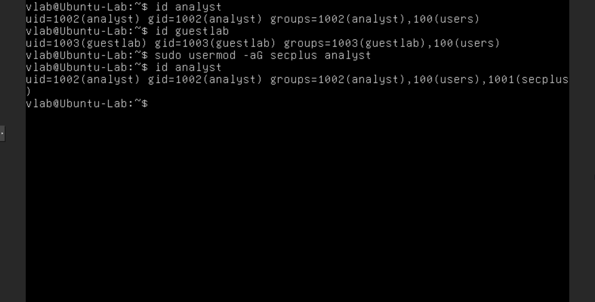

**Commands:**

```bash
id analyst
id guestlab
sudo usermod -aG secplus analyst
id analyst
```

The final `id analyst` output includes `secplus`; the displayed `id guestlab` output does not. The `-aG` options add `secplus` as a supplementary group for `analyst` while preserving existing supplementary group memberships.

### Step 2.5 - Create the group-controlled file

Create the lab directory and write sample content to the file whose access will be tested.

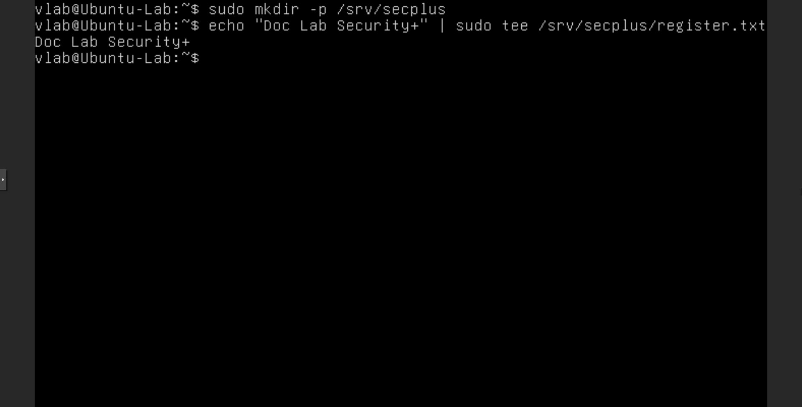

**Commands:**

```bash
sudo mkdir -p /srv/secplus
echo "Doc Lab Security+" | sudo tee /srv/secplus/register.txt
```

The `tee` output confirms that the sample text was written to `/srv/secplus/register.txt`. This file is separate from the decoy honeyfile used later.

### Step 2.6 - Set ownership and restrict file permissions

Assign the file to the `secplus` group, set its mode, and inspect the resulting ownership and permissions.

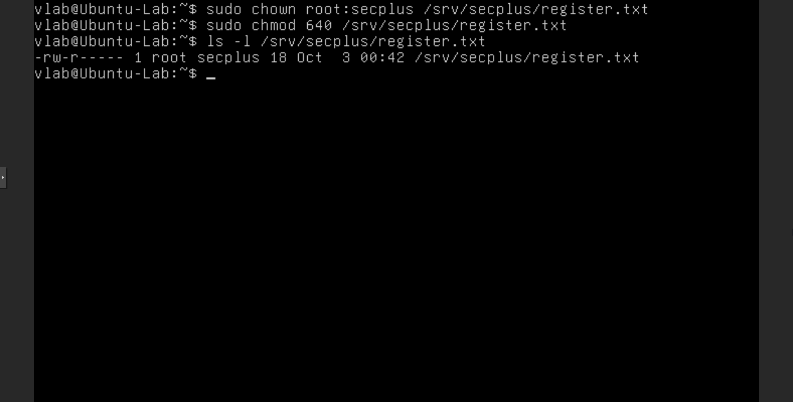

**Commands:**

```bash
sudo chown root:secplus /srv/secplus/register.txt
sudo chmod 640 /srv/secplus/register.txt
ls -l /srv/secplus/register.txt
```

The listing shows owner `root`, group `secplus`, and mode `-rw-r-----` (`640`). The owner has read/write access, members of `secplus` have read access, and other users have no file permissions.

### Step 2.7 - Verify access as the authorized group member

Switch to `analyst` and read the file.

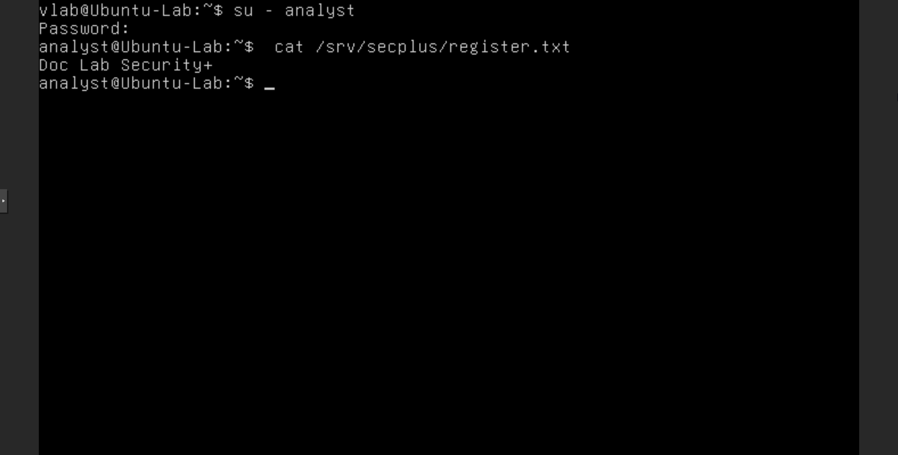

**Commands:**

```bash
su - analyst
cat /srv/secplus/register.txt
```

The shell changes to `analyst`, and the file displays `Doc Lab Security+`. This result is consistent with `analyst` belonging to `secplus` and the group having read permission.

### Step 2.8 - Verify access denial for a user outside the group

Switch to `guestlab` and attempt to read the same file.

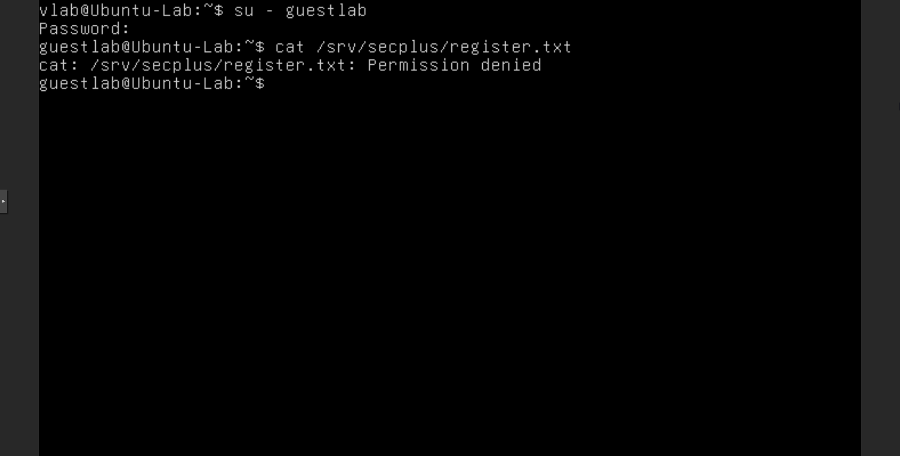

**Commands:**

```bash
su - guestlab
cat /srv/secplus/register.txt
```

The screenshot shows `Permission denied`. `guestlab` is not a member of `secplus`, and mode `640` grants no access to other users. The paired tests show the different authorization outcomes for the two accounts.

This section shows how authentication establishes the active account context while group membership and file permissions determine authorization. The successful and denied read attempts validate the configured access boundary for this file.

## 3. Authentication and Accounting Records

**Objective:** review system and authentication logs after switching between the test accounts, and identify the session activity recorded by Ubuntu.

### Step 3.1 - Review recent journal events

Inspect recent journal entries that include the account switches performed during the access tests.

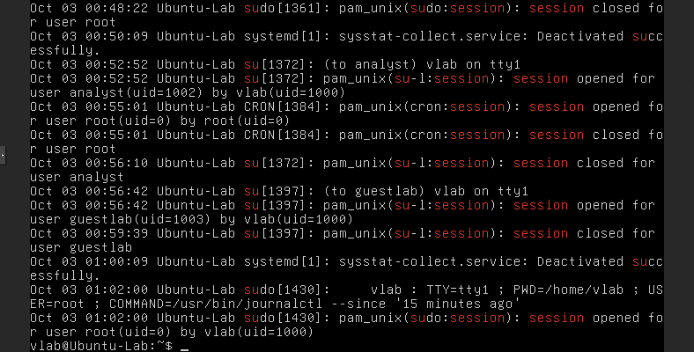

**Command:**

```bash
sudo journalctl --since '15 minutes ago'
```

The screenshot includes `su` session-open and session-close events for `analyst` and `guestlab`, along with other system and sudo activity from the same period. These entries provide an audit trail of the account context changes shown in Section 2.

### Step 3.2 - Review `/var/log/auth.log`

Check the authentication log for the same account-switch activity.

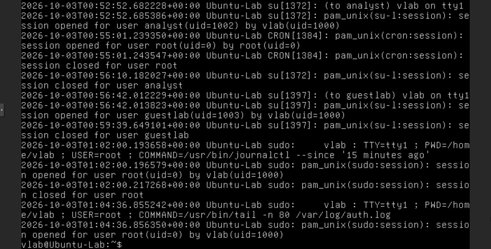

**Command:**

```bash
sudo tail -n 80 /var/log/auth.log
```

The displayed records include PAM session events for `analyst` and `guestlab`, as well as sudo activity associated with log review. The log supports the session timeline; it does not replace the file-level permission test or identify every file read.

This section connects the authentication tests to accounting evidence. The journal and authentication log record session activity, while the auditd watch in the next section records access to a specific file.

## 4. Honeyfile Monitoring with auditd

**Objective:** create a decoy file with fabricated content, monitor read access with auditd, and verify that the test account's access appears in the audit records.

### Step 4.1 - Enable and start auditd

Enable the audit service at startup and start it immediately.

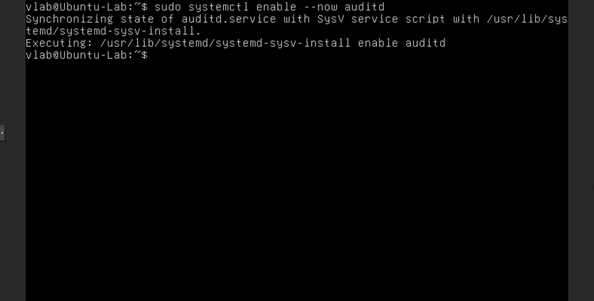

**Command:**

```bash
sudo systemctl enable --now auditd
```

The command enables the service and requests an immediate start. The subsequent status check verifies the service state.

### Step 4.2 - Verify auditd status

Check that auditd is enabled and running before configuring the file watch.

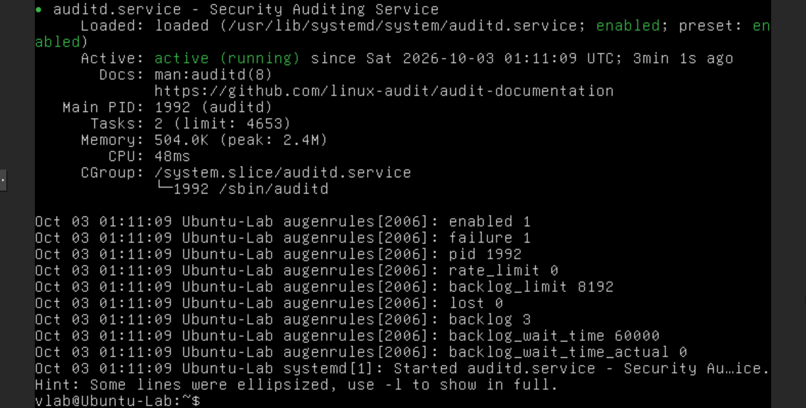

**Command:**

```bash
sudo systemctl status auditd --no-pager
```

The screenshot shows `auditd.service` loaded as enabled and `active (running)`, confirming that the auditing service is operating at this point in the lab.

### Step 4.3 - Create the fabricated honeyfile

Create a decoy file under `/srv/shared`, write a clearly fabricated notice, and set permissions for the controlled read test.

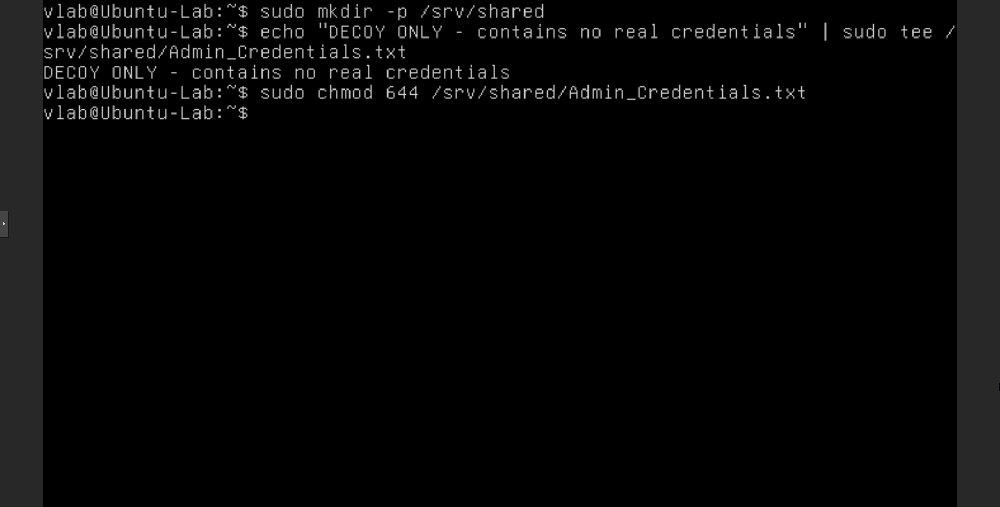

**Commands:**

```bash
sudo mkdir -p /srv/shared
echo "DECOY ONLY - contains no real credentials" | sudo tee /srv/shared/Admin_Credentials.txt
sudo chmod 644 /srv/shared/Admin_Credentials.txt
```

The `tee` output shows that the file contains only the stated decoy text. Mode `644` makes the file readable by the test account so the read can generate an audit event. This configuration is for the isolated lab VM; the file must not contain real credentials, tokens, or other sensitive information.

### Step 4.4 - Add a runtime read watch and inspect the baseline

Add an audit rule for read access to the honeyfile, then query events associated with its key before the `guestlab` access test.

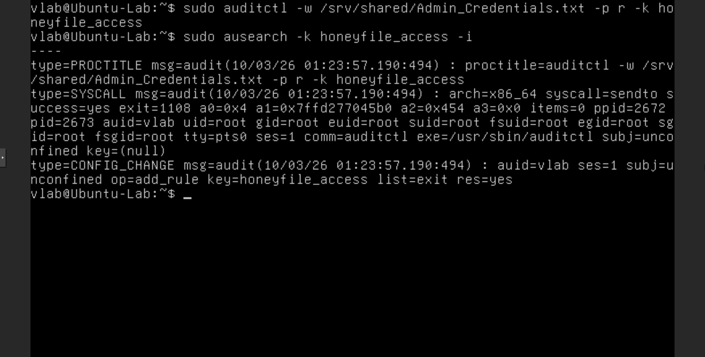

**Commands:**

```bash
sudo auditctl -w /srv/shared/Admin_Credentials.txt -p r -k honeyfile_access
sudo ausearch -k honeyfile_access -i
```

`-w` watches the specified path, `-p r` selects read access, and `-k honeyfile_access` assigns a searchable key. The baseline output shows audit records for configuring the watch; it does not yet show the later `guestlab` read event.

### Step 4.5 - Read the honeyfile as `guestlab`

Switch to the test account and read the decoy file to generate the monitored event.

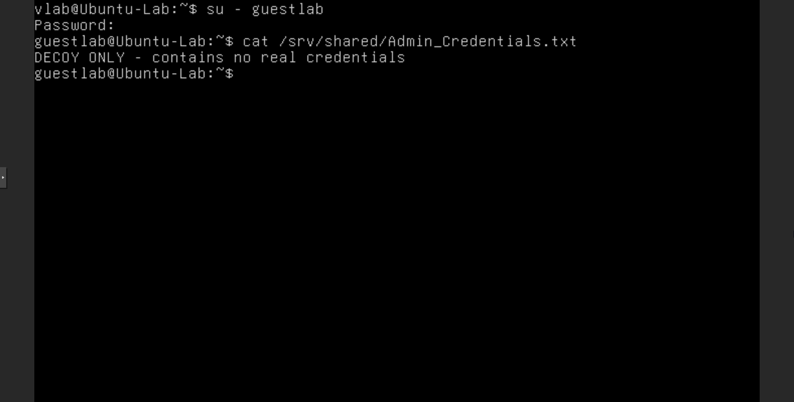

**Commands:**

```bash
su - guestlab
cat /srv/shared/Admin_Credentials.txt
```

The screenshot shows the decoy text returned to `guestlab`. This is the controlled access event that the audit rule is intended to record.

### Step 4.6 - Verify the honeyfile access event

Search audit records by the configured key and inspect the event associated with the read.

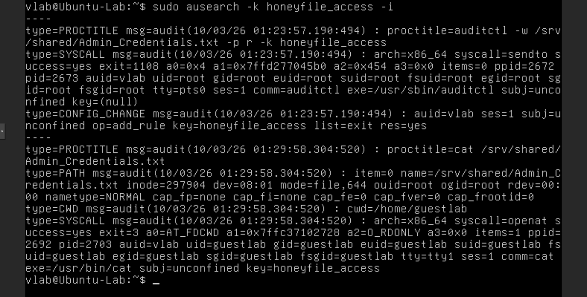

**Command:**

```bash
sudo ausearch -k honeyfile_access -i
```

The output includes the honeyfile path, the `cat` process, and `guestlab` as the audit user for a successful file-open event. This ties the observed access to the test account and the monitored file.

### Step 4.7 - Write a persistent audit-rule file

Write the watch rule to the audit rules directory so it can be loaded from the system's persistent rule configuration.

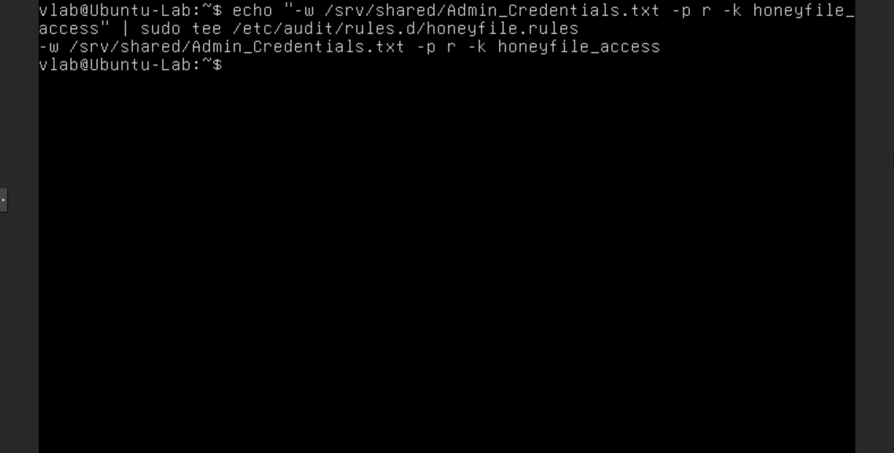

**Command:**

```bash
echo "-w /srv/shared/Admin_Credentials.txt -p r -k honeyfile_access" | sudo tee /etc/audit/rules.d/honeyfile.rules
```

The screenshot confirms that the rule text was written to `/etc/audit/rules.d/honeyfile.rules`.

This section demonstrates a honeyfile as a deception mechanism and auditd as a source of detective evidence. The audit record identifies the account and file access; persistence of the rule across a reboot remains unverified.

## Security+ Concept Mapping

| Lab evidence | Security+ concept | What the evidence supports |
|---|---|---|
| SHA-256 digest before and after a content change | Integrity | The digest changed with the file content; the hash alone does not establish origin or identity. |
| `analyst` and `guestlab` access tests | Authentication and Authorization | The active account context differs, and group membership plus mode `640` determines access to the register file. |
| Journal and `/var/log/auth.log` session records | Accounting | Ubuntu records account session activity and related administrative events. |
| Decoy file monitored by auditd | Deception; Technical and Detective control functions | A honeyfile provides a decoy resource, and the audit record exposes access to it. |

## Observed Final State

- The Windows test file was edited, and the displayed SHA-256 digest changed.
- The `secplus` group exists, and `analyst` is shown as a member; `guestlab` is not shown as a member.
- `/srv/secplus/register.txt` is owned by `root:secplus` with mode `640`; `analyst` read it successfully and `guestlab` received `Permission denied`.
- The journal and `/var/log/auth.log` show session activity for both test accounts.
- `auditd` is shown as enabled and active. The runtime watch recorded `guestlab` reading the fabricated `/srv/shared/Admin_Credentials.txt` file.
- The persistent rule text is present in the captured `tee` output, but loading it from disk and validating persistence after reboot were not documented.

## Portfolio Summary

Hands-on Security+ SY0-701 lab covering file integrity verification with SHA-256, Linux account and group administration, group-based file authorization, authentication/accounting log review, and auditd monitoring of a decoy honeyfile. The evidence shows a changed digest, different access outcomes for authorized and unauthorized test accounts, session records, and a honeyfile read event attributed to `guestlab`.
