# Security+ Lab 1.3 - Change Management

**CompTIA Security+ SY0-701 - Domain 1: General Security Concepts - Objective 1.3**

This report documents a controlled Nginx port change from TCP/80 to TCP/8080, the firewall dependency discovered during validation, the Git change record, and the backout to TCP/80. The screenshots show the actions and results on Ubuntu Server and Kali Linux.

## Lab Overview

- **Ubuntu server:** 172.16.40.20
- **Kali validation client:** 172.16.40.104
- **Service and firewall:** Nginx and UFW
- **Initial and restored service port:** TCP/80
- **Temporary service port:** TCP/8080
- **Change workspace:** ~/change-lab
- **Tracked configuration copy:** ~/change-lab/nginx-default.conf
- **Operational configuration:** /etc/nginx/sites-available/default
- **Pre-change backout copy:** /etc/nginx/sites-available/default.pre-change
- **Result:** Nginx listened on TCP/8080 after the change. Kali initially timed out because UFW had no rule for TCP/8080. After a source-specific rule was added, Kali received HTTP/1.1 200 OK. The backout restored Nginx to TCP/80, which Kali validated, and the temporary UFW rule was removed.

The screenshots document the two lab endpoints and their observed tests. They do not independently verify network isolation.

## Change Request

**Objective:** record the proposed change, scope, impact, validation criteria, owner, stakeholder, and backout approach before implementation.

| Field | Lab scenario |
|---|---|
| Reason | Practice a controlled Nginx port change from TCP/80 to TCP/8080. |
| Initial scope | Ubuntu server 172.16.40.20; modify /etc/nginx/sites-available/default. |
| Owner | Lab administrator. |
| Stakeholder | Lab operator validating the service from Kali at 172.16.40.104. |
| Planned impact | Brief Nginx service interruption during restart; TCP/80 is expected to stop responding while the change is active. The actual interruption duration was not measured. |
| Expected test result | TCP/8080 responds; TCP/80 does not respond while the change is active. |
| Backout | Restore the pre-change configuration, run nginx -t, restart Nginx, and validate TCP/80 from Kali. |
| Maintenance window | 30-minute lab window. |
| Approval | Approved for practice in the lab scenario; not evidence of an enterprise CAB or production approval. |

The owner, stakeholder, approval, maintenance window, and later business dependency are scenario details for this exercise. The screenshots do not show a formal approval record.

## 1. Nginx Baseline

**Objective:** confirm that Nginx is running on Ubuntu and reachable from Kali before modifying the service.

### Step 1.1 - Verify the Nginx service on Ubuntu

Check the service state and listening sockets before making the change.

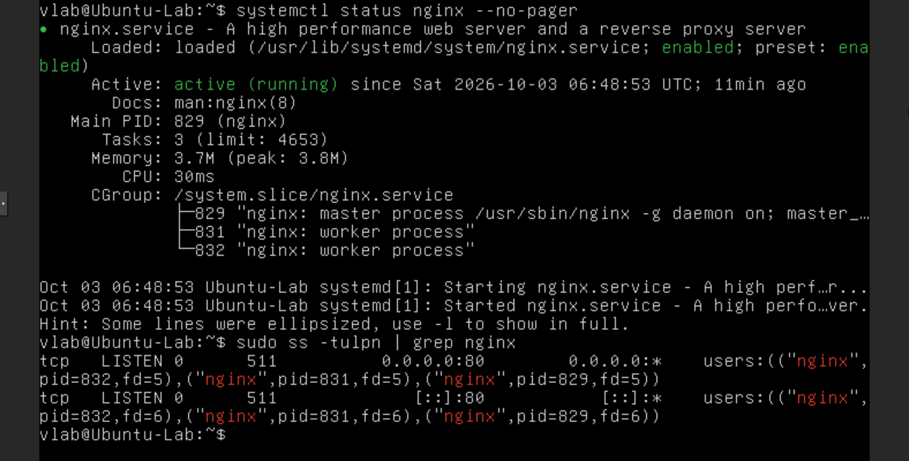

**Commands:**

```bash
systemctl status nginx --no-pager
sudo ss -tulpn | grep nginx
```

The service output shows Nginx as active (running). The socket listing shows listeners on TCP/80 for IPv4 and IPv6.

### Step 1.2 - Validate HTTP from Kali

Request the Ubuntu server's default HTTP page from the Kali client.

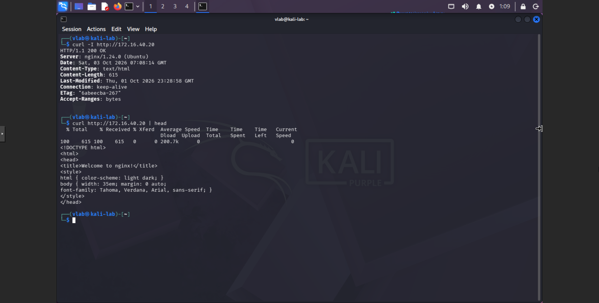

**Commands:**

```bash
curl -I http://172.16.40.20
curl http://172.16.40.20 | head
```

The first request returns HTTP/1.1 200 OK, and the second returns the beginning of the Nginx HTML page. This establishes the client-side baseline before the port change.

This baseline gives the later port tests a known comparison point: Nginx responded on TCP/80 before the configuration changed.

## 2. Backout Preparation and Version-Control Baseline

**Objective:** preserve a direct pre-change configuration copy for operational backout and create a Git baseline for change history.

### Step 2.1 - Create the working directory and commit the baseline

Copy the current Nginx site configuration into the lab workspace, initialize Git, and record the starting version.

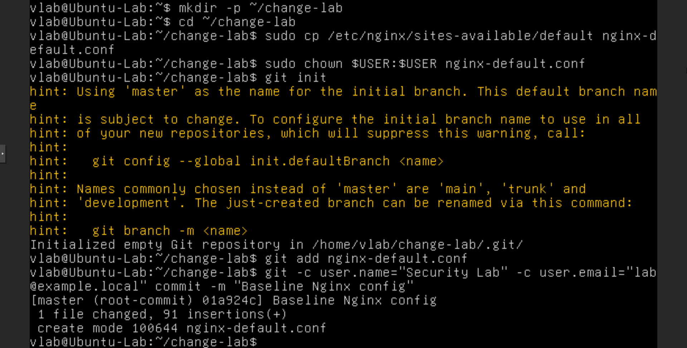

**Commands:**

```bash
mkdir -p ~/change-lab
cd ~/change-lab
sudo cp /etc/nginx/sites-available/default nginx-default.conf
sudo chown $USER:$USER nginx-default.conf
git init
git add nginx-default.conf
git -c user.name="Security Lab" -c user.email="lab@example.local" commit -m "Baseline Nginx config"
```

The output shows an initialized repository and a successful Baseline Nginx config commit. The tracked file is a working copy of the Nginx configuration.

### Step 2.2 - Create the direct backout copy

Copy the operational configuration to the pre-change path used by the backout procedure.

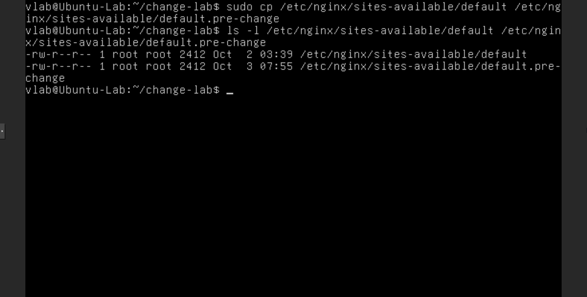

**Commands:**

```bash
sudo cp /etc/nginx/sites-available/default /etc/nginx/sites-available/default.pre-change
ls -l /etc/nginx/sites-available/default /etc/nginx/sites-available/default.pre-change
```

The terminal shows the copy command and lists both configuration files. This direct copy is used later to restore the operational Nginx configuration.

Git and the pre-change file serve different purposes: Git records version history and diffs, while default.pre-change is the operational copy used for backout.

## 3. Pre-Change Impact Check

**Objective:** verify that the existing Nginx configuration passes its syntax check and identify the service currently using TCP/80.

### Step 3.1 - Check Nginx syntax and the TCP/80 listener

Run a configuration test and inspect the process listening on port 80 before editing the file.

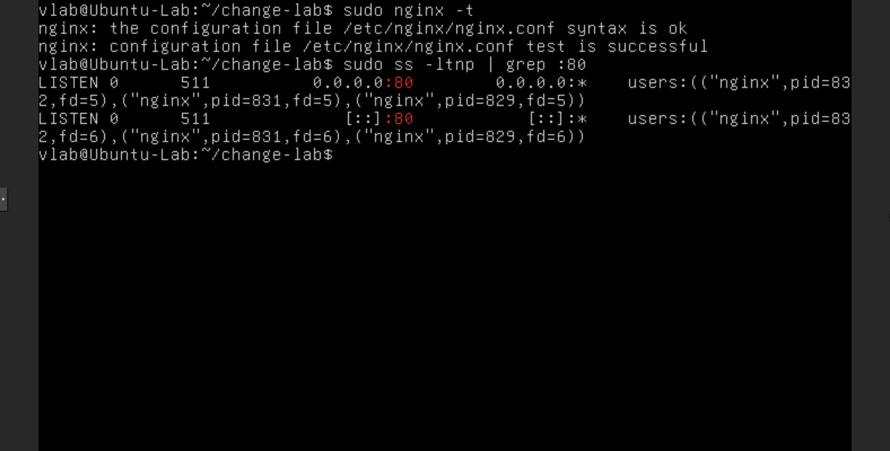

**Commands:**

```bash
sudo nginx -t
sudo ss -ltnp | grep :80
```

The output reports that the Nginx syntax is ok and the configuration test is successful. The socket output shows Nginx listening on TCP/80 for IPv4 and IPv6. This confirms the starting service state but does not identify every possible downstream dependency.

This check establishes a healthy configuration and a known listener before implementation.

## 4. Implementing the Nginx Port Change

**Objective:** modify the in-scope Nginx site configuration so its default server listens on TCP/8080.

### Step 4.1 - Change the IPv4 and IPv6 listen directives

Open the default site configuration and change the listen port from 80 to 8080 for both address families shown in the file.

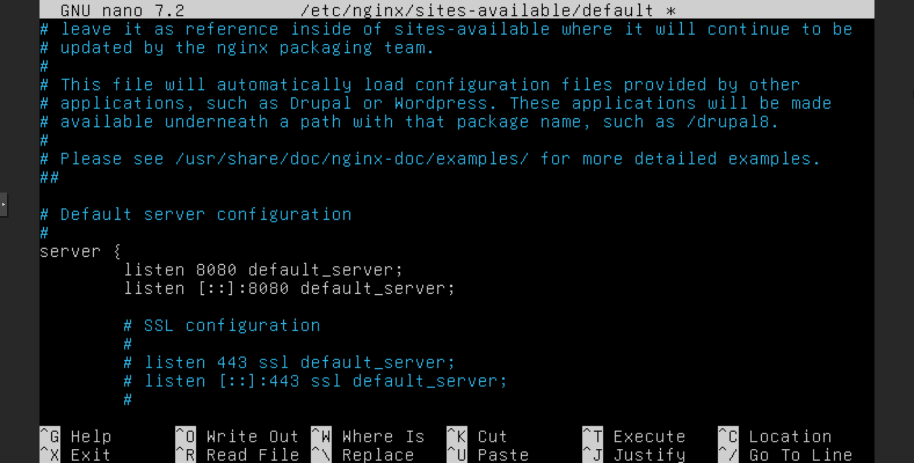

**Action:**

```bash
sudo nano /etc/nginx/sites-available/default
```

The editor screenshot shows listen 8080 default_server and listen [::]:8080 default_server. The following syntax check validates the saved configuration before restart.

The change remains within the initially recorded Nginx file scope at this point. The UFW dependency is investigated and handled as a separate, controlled scope amendment below.

## 5. Configuration Validation and Service Restart

**Objective:** reject invalid configuration before applying it, restart only the Nginx service, and verify the new listener locally on Ubuntu.

### Step 5.1 - Validate the changed configuration

Run the Nginx syntax test before restarting the service.

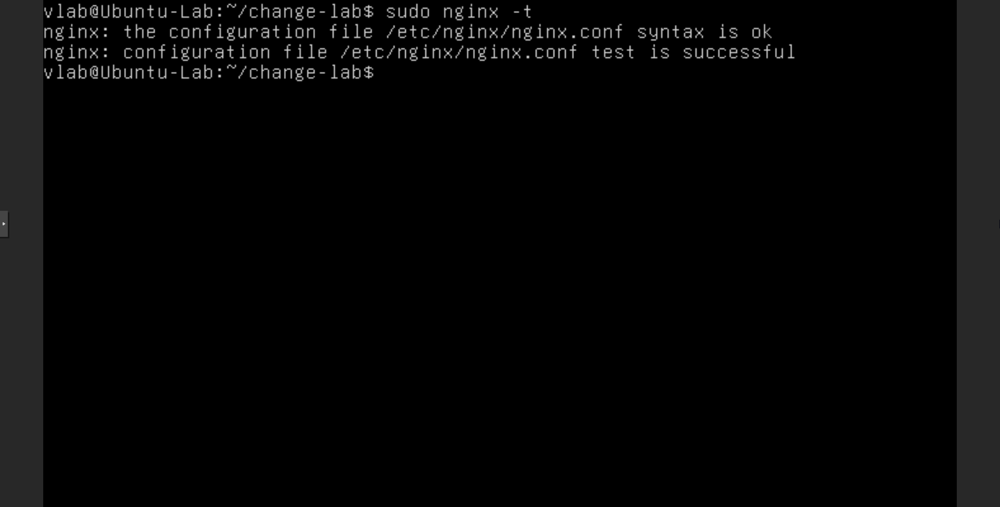

**Command:**

```bash
sudo nginx -t
```

The output states that the syntax is ok and the configuration test is successful. This is the pre-restart validation gate.

### Step 5.2 - Restart Nginx and check its service state

Apply the validated configuration by restarting Nginx, then inspect the service status.

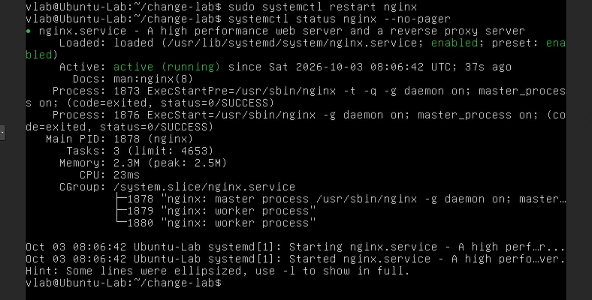

**Commands:**

```bash
sudo systemctl restart nginx
systemctl status nginx --no-pager
```

The screenshot shows the Nginx restart command followed by an active (running) service state. The command targets the Nginx service rather than rebooting Ubuntu.

### Step 5.3 - Confirm the TCP/8080 listener

Inspect Nginx sockets after the restart.

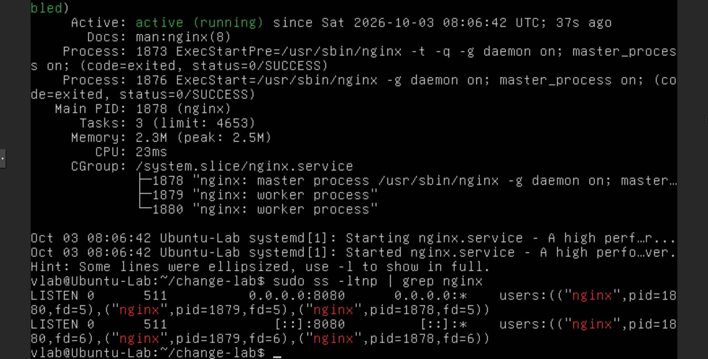

**Command:**

```bash
sudo ss -ltnp | grep nginx
```

The output shows Nginx listening on 0.0.0.0:8080 and [::]:8080. This confirms the server-side listener; it does not yet confirm remote reachability.

This phase follows the planned control sequence: validate syntax, restart the affected service, and verify its listener without restarting the operating system.

## 6. Initial Validation Failure and Dependency Discovery

**Objective:** investigate why Kali cannot reach TCP/8080 even though Nginx is listening on that port locally.

### Step 6.1 - Test TCP/8080 from Kali

Send a bounded HTTP request to the changed port from the validation client.

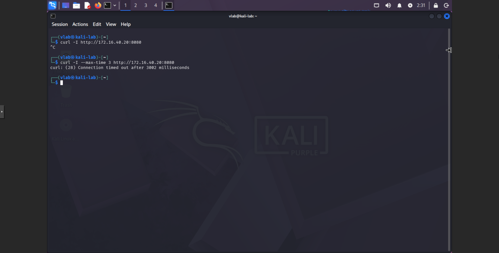

**Command:**

```bash
curl -I --max-time 3 http://172.16.40.20:8080
```

The output reports a connection timeout after approximately three seconds. The timeout shows that this client request did not receive an HTTP response; by itself, it does not identify the cause.

The screenshot also contains an earlier unbounded request that was manually cancelled with Ctrl+C. The three-second bounded request is used as the documented validation result.

### Step 6.2 - Inspect the UFW rules

Review the active numbered firewall rules and compare them with the Nginx listener and Kali test.

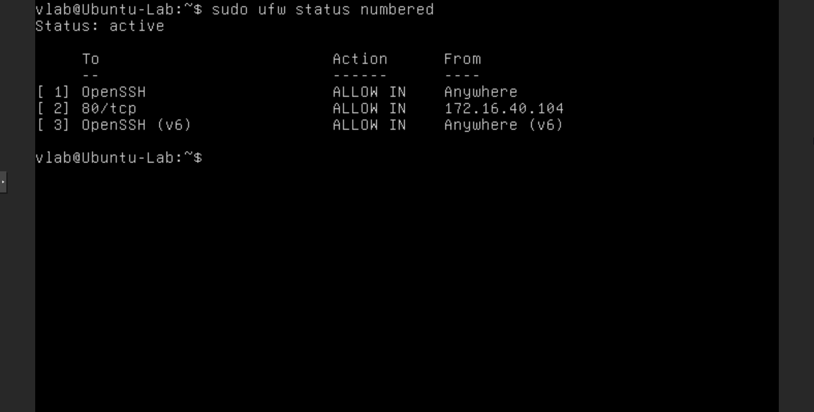

**Command:**

```bash
sudo ufw status numbered
```

The output shows UFW active, OpenSSH allowed, and TCP/80 allowed from 172.16.40.104. No TCP/8080 allow rule appears. Combined with the Ubuntu listener and Kali timeout, this identifies a firewall dependency missing from the initial Nginx-only scope. The successful request after a source-specific UFW rule provides additional validation of this diagnosis.

The failed client test revealed a related control outside the initial file scope. Treating it as dependency discovery preserves the troubleshooting evidence and informs a deliberate scope amendment.

## 7. Controlled Scope Amendment - UFW TCP/8080

**Objective:** make the minimum firewall change needed to validate the Nginx port change from the designated Kali client.

### Step 7.1 - Allow TCP/8080 from the validation client

Add a TCP/8080 rule limited to the Kali source address, then inspect the resulting rules.

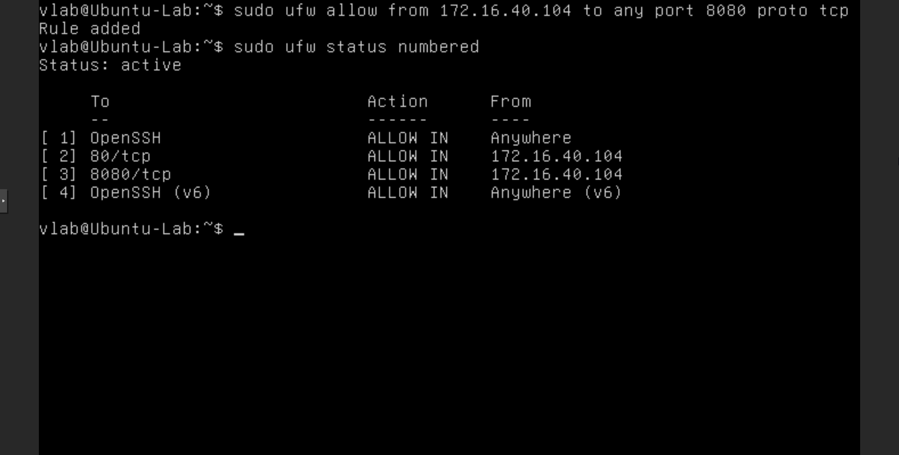

**Commands:**

```bash
sudo ufw allow from 172.16.40.104 to any port 8080 proto tcp
sudo ufw status numbered
```

The output confirms that UFW added the rule and shows 8080/tcp allowed from 172.16.40.104. The rule is limited to the validation client and TCP/8080. This is a controlled lab scope amendment, not evidence of a formal enterprise approval workflow.

The amended scope adds only the firewall access needed for the test client and port. The next step validates the outcome from Kali.

## 8. Successful Validation of TCP/8080

**Objective:** verify the service from Kali on the new port and confirm that the old port no longer accepts a connection while the change is active.

### Step 8.1 - Test the new and previous service ports

Request TCP/8080, then test the former HTTP port from the same Kali client.

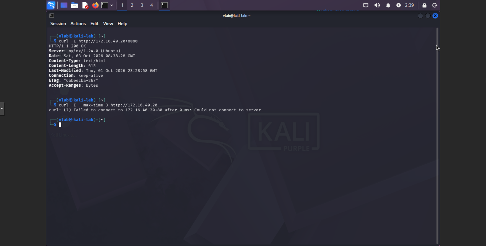

**Commands:**

```bash
curl -I http://172.16.40.20:8080
curl -I --max-time 3 http://172.16.40.20
```

The first request returns HTTP/1.1 200 OK from Nginx on TCP/8080. The second request cannot connect to TCP/80. Together with the Ubuntu socket check and UFW state, these results validate the temporary port change from Kali.

This phase demonstrates why validation needs both a positive test for the intended state and a check that the previous service behavior changed as expected.

## 9. Version-Control Diff and Change Commit

**Objective:** record the changed Nginx configuration in Git and retain a visible diff and commit history for traceability.

### Step 9.1 - Update the tracked copy and inspect the diff

Copy the active Nginx configuration into the Git working directory and display the changes against the baseline.

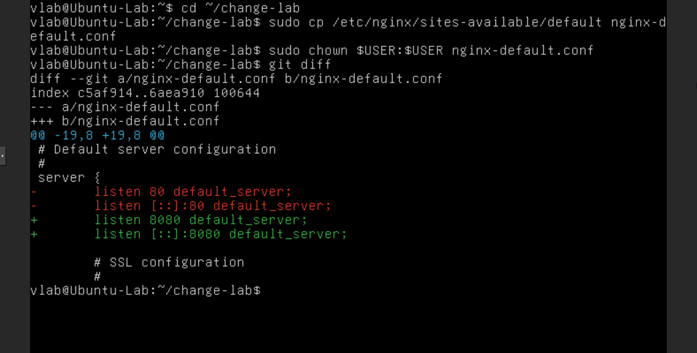

**Commands:**

```bash
cd ~/change-lab
sudo cp /etc/nginx/sites-available/default nginx-default.conf
sudo chown $USER:$USER nginx-default.conf
git diff
```

The diff shows the IPv4 and IPv6 listen directives changing from port 80 to port 8080. This records what changed in the tracked configuration copy.

### Step 9.2 - Commit the port change and inspect history

Stage the changed file, create the change commit, and display the recent Git history.

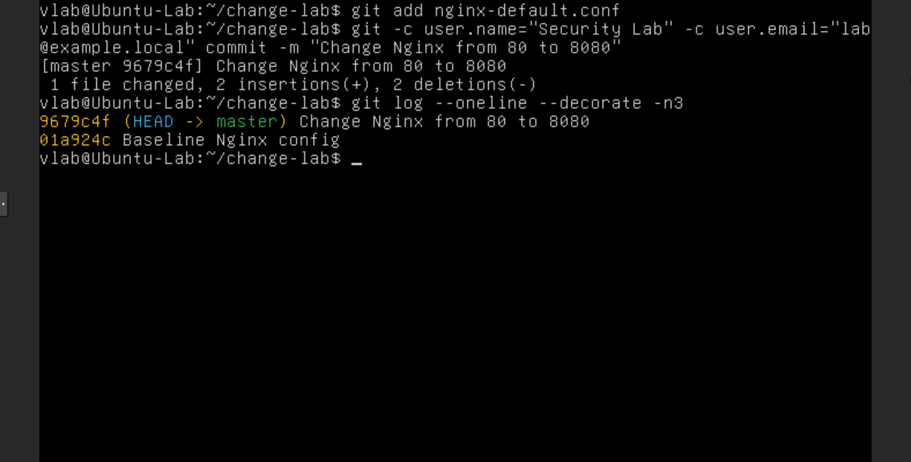

**Commands:**

```bash
git add nginx-default.conf
git -c user.name="Security Lab" -c user.email="lab@example.local" commit -m "Change Nginx from 80 to 8080"
git log --oneline --decorate -n 3
```

The output shows the Change Nginx from 80 to 8080 commit and the earlier Baseline Nginx config commit. Git provides version history and a reviewable diff; it is distinct from the pre-change file used for operational backout.

The captured Git history documents the temporary port change. The screenshots do not show a later Git commit or tracked-file update for the backout, so they do not establish that the Git working copy matches the final operational configuration.

## 10. Backout Plan Execution

**Objective:** respond to the lab's simulated business dependency on TCP/80 by restoring the pre-change Nginx configuration and confirming the restored listener.

### Step 10.1 - Restore the pre-change configuration

Use the direct backout copy, validate the restored configuration, restart Nginx, and inspect its listening sockets.

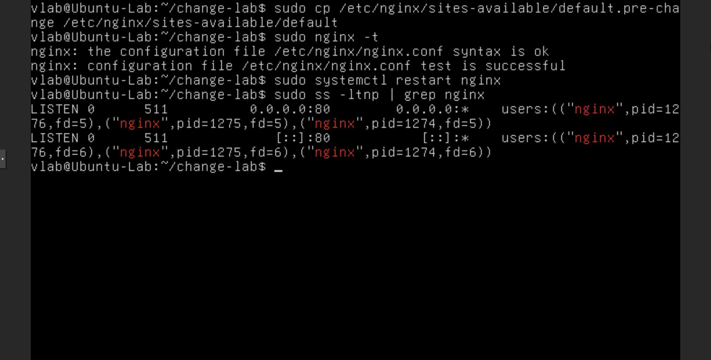

**Commands:**

```bash
sudo cp /etc/nginx/sites-available/default.pre-change /etc/nginx/sites-available/default
sudo nginx -t
sudo systemctl restart nginx
sudo ss -ltnp | grep nginx
```

The syntax test succeeds, and the socket output shows Nginx listening on TCP/80 for IPv4 and IPv6. This validates the server-side restoration. The business dependency on TCP/80 is simulated for the lab; no real enterprise application or production impact is claimed.

The operational backout uses the saved configuration copy, followed by syntax, service, and listener checks.

## 11. Backout Validation from Kali

**Objective:** confirm from the client that TCP/80 works again and TCP/8080 is no longer reachable after backout.

### Step 11.1 - Test both ports from Kali after restoration

Request the restored HTTP endpoint and then test the temporary port.

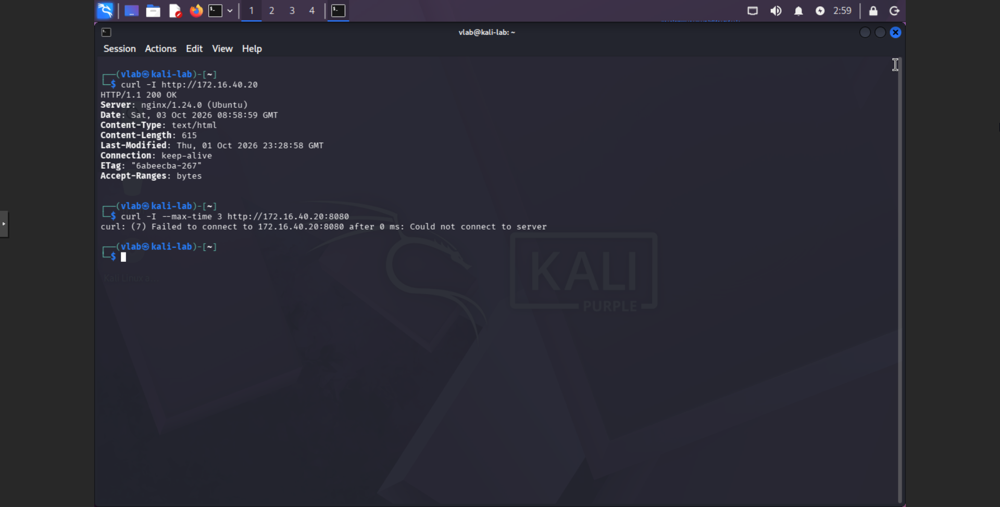

**Commands:**

```bash
curl -I http://172.16.40.20
curl -I --max-time 3 http://172.16.40.20:8080
```

The request to TCP/80 returns HTTP/1.1 200 OK. The request to TCP/8080 fails to connect. These client-side results validate the backout from the same client used for the earlier tests.

This validation confirms that backout restored the original client-visible service port and removed the temporary Nginx listener behavior.

## 12. Firewall Cleanup and Final State

**Objective:** remove the temporary TCP/8080 firewall amendment and verify that the firewall rules reflect the restored service state.

### Step 12.1 - Delete the temporary UFW rule

Remove the client-specific TCP/8080 rule and display the remaining active rules.

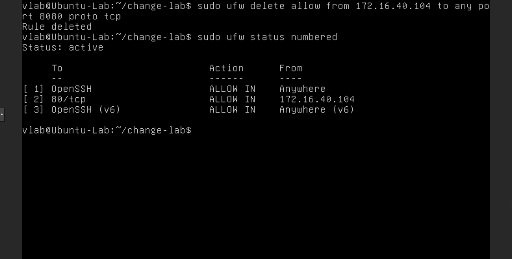

**Commands:**

```bash
sudo ufw delete allow from 172.16.40.104 to any port 8080 proto tcp
sudo ufw status numbered
```

UFW reports that the rule was deleted. The final status lists OpenSSH and TCP/80 allowed from 172.16.40.104; no TCP/8080 rule appears. This removes the firewall scope amendment along with the Nginx port change.

The backout restored both parts of the operational state changed during the exercise: Nginx listens on TCP/80, and the temporary TCP/8080 UFW rule is absent.

## Change Management Concept Mapping

| Lab evidence | Objective 1.3 concept | What the evidence supports |
|---|---|---|
| Change Request scenario | Approval process, scope, ownership, stakeholders, maintenance window | Records the planned change and roles as lab scenario details, not a production change record. |
| Nginx and Kali baseline; pre-change syntax and listener checks | Baseline, impact analysis, test results | Captures the initial service behavior and checks the configuration and port before implementation. |
| default.pre-change copy | Backout planning | Creates a direct configuration copy and later uses it to restore the service. |
| nginx -t followed by systemctl restart nginx | Testing and service restart | Syntax is checked before applying the change; the command restarts Nginx rather than Ubuntu. |
| Nginx listens on TCP/8080 while Kali times out; UFW has no TCP/8080 rule | Dependency discovery and troubleshooting | Correlates a local listener, remote validation failure, and the missing firewall rule. |
| Source-specific UFW rule and subsequent Kali HTTP/1.1 200 OK | Controlled scope amendment and validation | Adds access for the designated client and validates the changed service from Kali. |
| Git baseline, diff, and change commit | Version control, documentation, traceability | Shows the original configuration, the port changes, and a commit recording the temporary change. |
| Simulated TCP/80 dependency and restoration from the saved copy | Backout plan and impact response | Returns Nginx to the earlier service port and validates syntax and listening sockets. |
| Kali tests after backout and final UFW status | Backout validation and final-state documentation | Confirms TCP/80 responds, TCP/8080 does not connect, and the temporary firewall rule is removed. |

## Troubleshooting / Lessons Learned

The first remote TCP/8080 test timed out even though Ubuntu showed Nginx listening on that port. Checking UFW showed that the existing rule allowed TCP/80 from Kali but did not allow TCP/8080. A narrowly scoped rule for the Kali client enabled the HTTP/1.1 200 OK test. This sequence demonstrates the value of validating each layer and using the failure to update the change scope in a controlled way.

Git and the direct backout copy also solve different problems. The diff and commits provide configuration history; the pre-change copy is what restored the operational Nginx file.

## Observed Final State

- Nginx passed a syntax check after backout, and the Ubuntu socket listing showed listeners on TCP/80.
- Kali received HTTP/1.1 200 OK from 172.16.40.20 on TCP/80.
- Kali could not connect to TCP/8080 after backout.
- UFW remained active, retained OpenSSH access and the TCP/80 rule from 172.16.40.104, and no longer listed TCP/8080.
- The Git evidence shows the baseline commit and the temporary change commit to TCP/8080. It does not show a Git update or commit reflecting the later backout.
- The approval, owner, stakeholder, maintenance window, and TCP/80 business dependency are lab scenario details. No enterprise production approval or impact is claimed.

## Portfolio Summary

Hands-on Security+ SY0-701 change-management lab documenting a planned Nginx port change, pre-change checks, syntax validation, a service-only restart, client-side testing, discovery of a missing UFW dependency, a controlled source-specific firewall amendment, Git diff and commit evidence, backout execution, client-side backout validation, and firewall cleanup. The observed final operational state returned to TCP/80.