# Security+ Lab 1.4 - Cryptographic Solutions

**CompTIA Security+ SY0-701 - Domain 1: General Security Concepts - Objective 1.4**

This report documents four cryptographic exercises: hybrid encryption, digital signatures, a small certificate authority (CA) and certificate chain, and salted PBKDF2 key derivation. Each phase records the commands, evidence, and observed results from the lab systems.

## Lab Overview

- **Kali Linux:** OpenSSL sender and workstation; OpenSSL 3.6.4.
- **Ubuntu Server:** hybrid-encryption recipient at 172.16.40.20; OpenSSL 3.0.13.
- **Tools:** OpenSSL, SCP, Python hashlib, os.urandom, and time.perf_counter.
- **Lab workspaces:** ~/secplus/hybrid, ~/secplus/signature, ~/secplus/pki, and ~/secplus/hashing.
- **Result:** Ubuntu recovered the sample message after receiving the encrypted payload and RSA-protected session secret. The original digital signature verified, then failed after the document changed. OpenSSL verified the server certificate when given the lab root and could not build trust without it. The PBKDF2 runs produced distinct salts and derived values, with higher measured runtime at higher iteration counts.

The screenshots document the systems and outputs used in these exercises. They do not demonstrate a TLS session, installation of the lab root in a system trust store, production PKI governance, or protection of real credentials.

## 1. Hybrid Encryption

**Objective:** demonstrate how symmetric encryption protects a data payload while asymmetric encryption protects a smaller session secret for the recipient.

### Step 1.1 - Verify OpenSSL on both systems

Run the version check on Ubuntu and Kali before using OpenSSL.

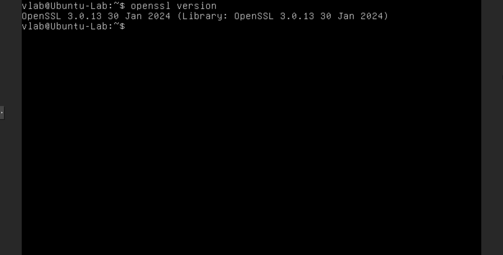

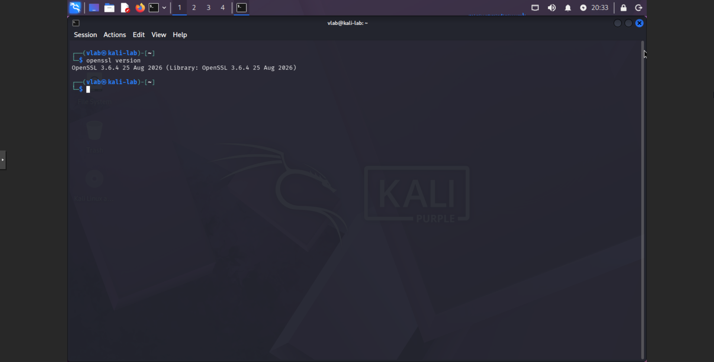

**Command:**

```bash
openssl version
```

The outputs confirm OpenSSL is available on both systems and show the versions used for this lab.

### Step 1.2 - Create the Ubuntu RSA key pair

Generate a 3072-bit RSA private key, derive its public key, and restrict access to the private key.

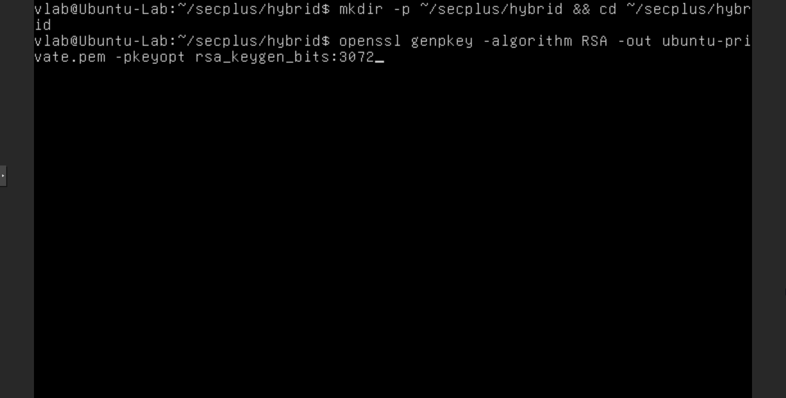

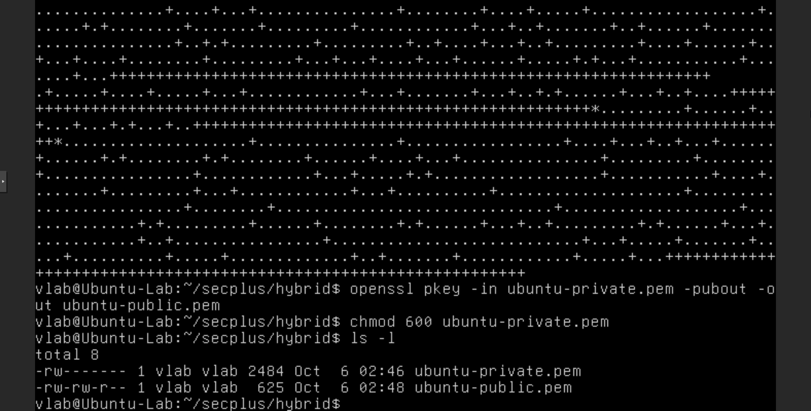

**Commands:**

```bash
mkdir -p ~/secplus/hybrid && cd ~/secplus/hybrid
openssl genpkey -algorithm RSA -out ubuntu-private.pem -pkeyopt rsa_keygen_bits:3072
openssl pkey -in ubuntu-private.pem -pubout -out ubuntu-public.pem
chmod 600 ubuntu-private.pem
ls -l
```

The first capture records the key-generation command. The next shows public-key derivation and a file listing where ubuntu-private.pem has mode 600. The private-key contents are not displayed.

### Step 1.3 - Copy only the public key to Kali

Transfer the public key to the Kali workspace so Kali can protect the session secret for Ubuntu.

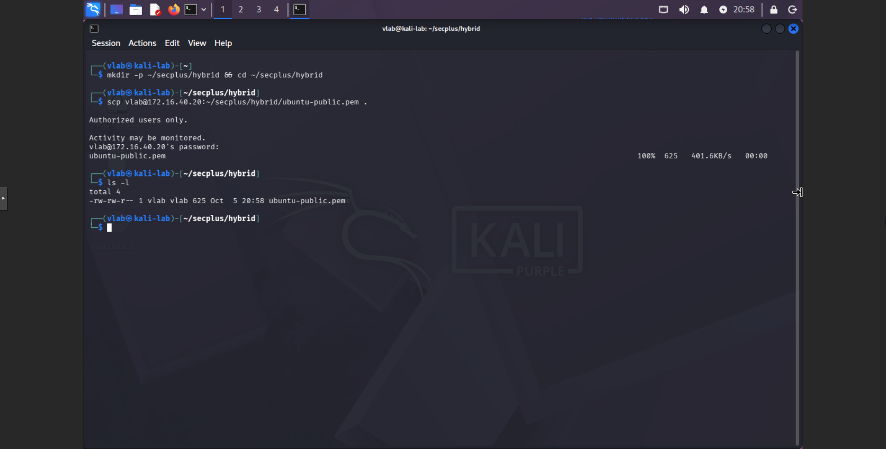

**Command:**

```bash
scp vlab@172.16.40.20:~/secplus/hybrid/ubuntu-public.pem .
```

The file listing confirms ubuntu-public.pem is present in Kali's workspace. The private key remains on Ubuntu.

### Step 1.4 - Prepare a sample message and session secret

Create the sample plaintext and generate a random hex-encoded session secret on Kali.

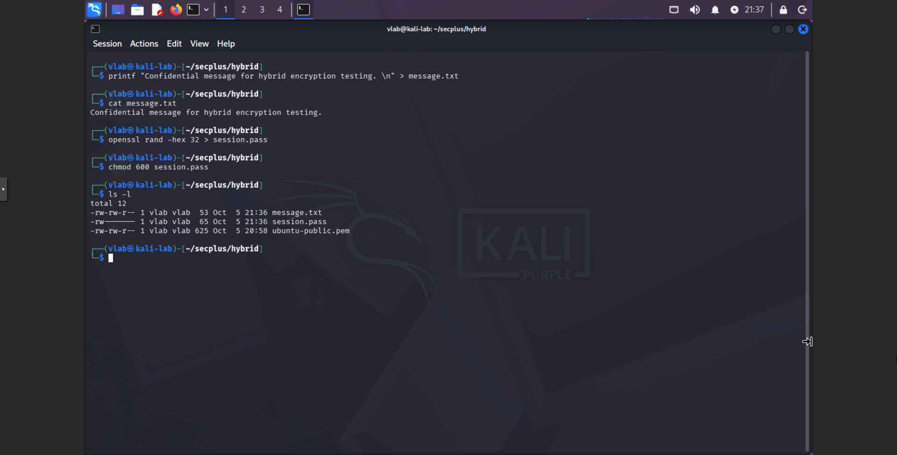

**Commands:**

```bash
printf 'Confidential message for hybrid encryption testing.\n' > message.txt
openssl rand -hex 32 > session.pass
chmod 600 session.pass
ls -l
```

The displayed message is the lab plaintext. The file listing shows session.pass with owner-only permissions; its contents are not shown. OpenSSL consumes this file as passphrase input for the AES operation.

### Step 1.5 - Encrypt the message with AES-256-CBC

Encrypt the message on Kali using AES-256-CBC, a salt, and PBKDF2.

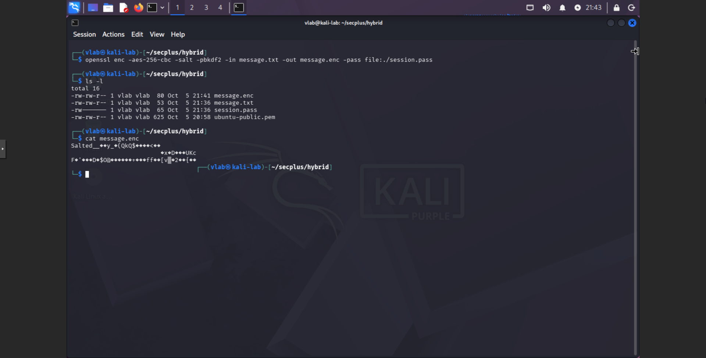

**Commands:**

```bash
openssl enc -aes-256-cbc -salt -pbkdf2 -in message.txt -out message.enc -pass file:./session.pass
ls -l
cat message.enc
```

The listing shows message.enc, and the terminal output is not readable as the original message. This demonstrates encryption of the sample payload. This CBC workflow does not demonstrate authenticated encryption or provide a separate integrity check.

### Step 1.6 - Protect the session secret with RSA-OAEP

Encrypt the session-secret file with Ubuntu's public key so only the matching private key can recover it.

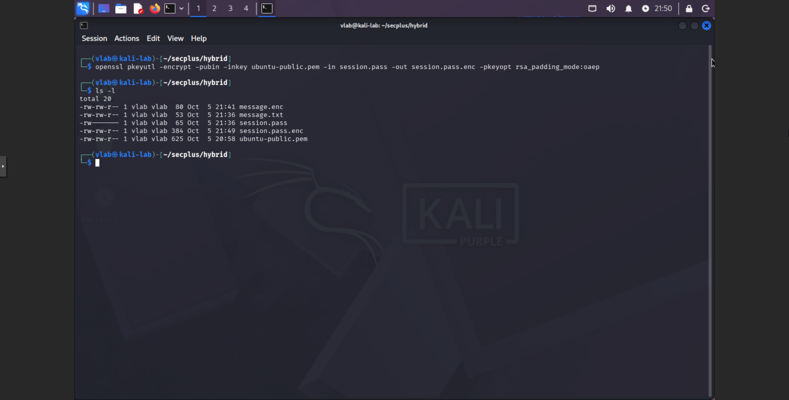

**Command:**

```bash
openssl pkeyutl -encrypt -pubin -inkey ubuntu-public.pem -in session.pass -out session.pass.enc -pkeyopt rsa_padding_mode:oaep
```

The output file session.pass.enc is the RSA-protected secret. RSA is used for the small secret; AES is used for the message payload.

### Step 1.7 - Transfer only the encrypted files

Send message.enc and session.pass.enc to the Ubuntu workspace.

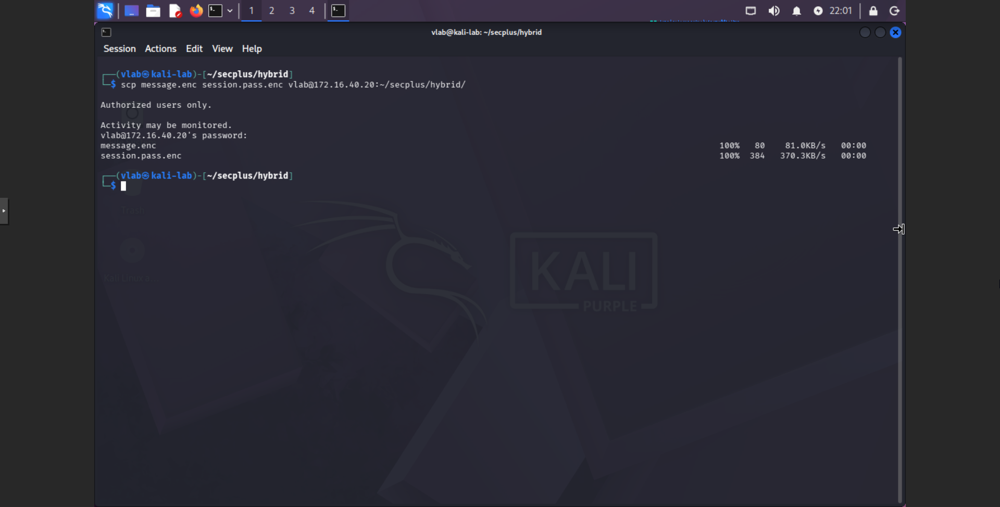

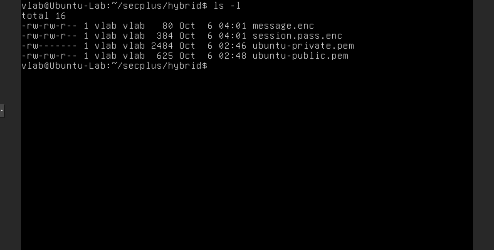

**Command:**

```bash
scp message.enc session.pass.enc vlab@172.16.40.20:~/secplus/hybrid/
```

The SCP output and Ubuntu listing show the two encrypted transfer files at the recipient. The screenshot lists ubuntu-private.pem on Ubuntu; it was not one of the transferred files. The plaintext message and plaintext session.pass are not shown as part of the transfer.

### Step 1.8 - Recover the session secret on Ubuntu

Use the Ubuntu private key to decrypt the RSA-protected session-secret file.

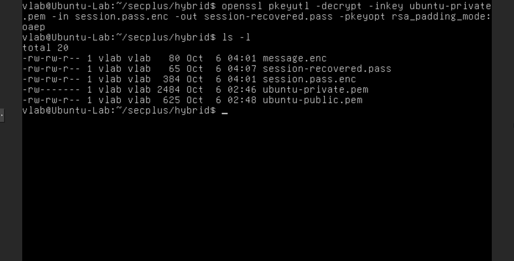

**Command:**

```bash
openssl pkeyutl -decrypt -inkey ubuntu-private.pem -in session.pass.enc -out session-recovered.pass -pkeyopt rsa_padding_mode:oaep
```

The command writes the recovered passphrase to session-recovered.pass. The screenshot shows the command and resulting file listing; it does not display the recovered secret's contents.

### Step 1.9 - Decrypt and validate the message

Use the recovered passphrase with the matching AES and PBKDF2 options.

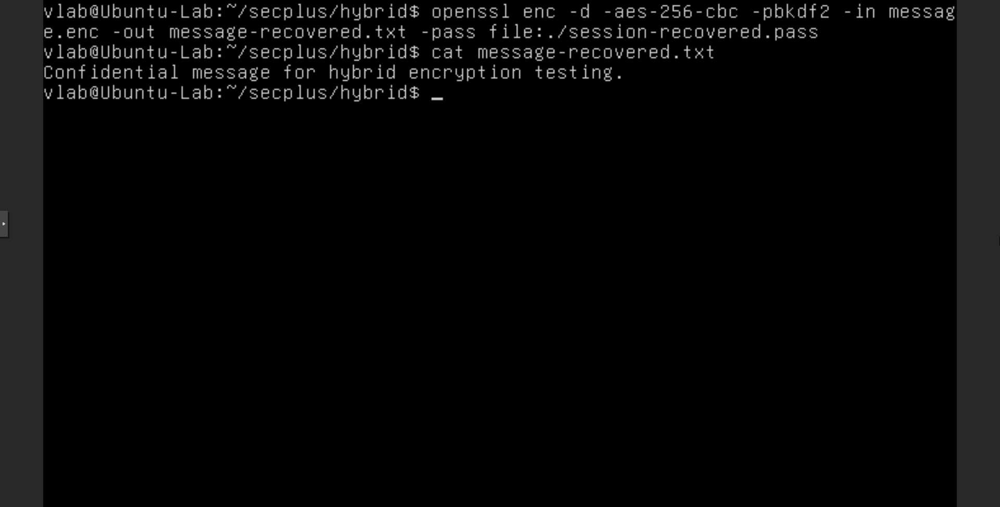

**Commands:**

```bash
openssl enc -d -aes-256-cbc -pbkdf2 -in message.enc -out message-recovered.txt -pass file:./session-recovered.pass
cat message-recovered.txt
```

The output is **Confidential message for hybrid encryption testing.**, matching the original sample. This validates the documented encrypt, transfer, session-secret recovery, and decrypt sequence.

This phase demonstrates the hybrid pattern: symmetric encryption handles the payload, while asymmetric encryption protects the recipient's session secret. It is a file-encryption exercise, not a TLS implementation or a network key-exchange protocol.

## 2. Digital Signatures

**Objective:** create and verify a digital signature, then change the signed document and observe tamper detection.

### Step 2.1 - Prepare the document

Create the authorization text in the Kali signature workspace.

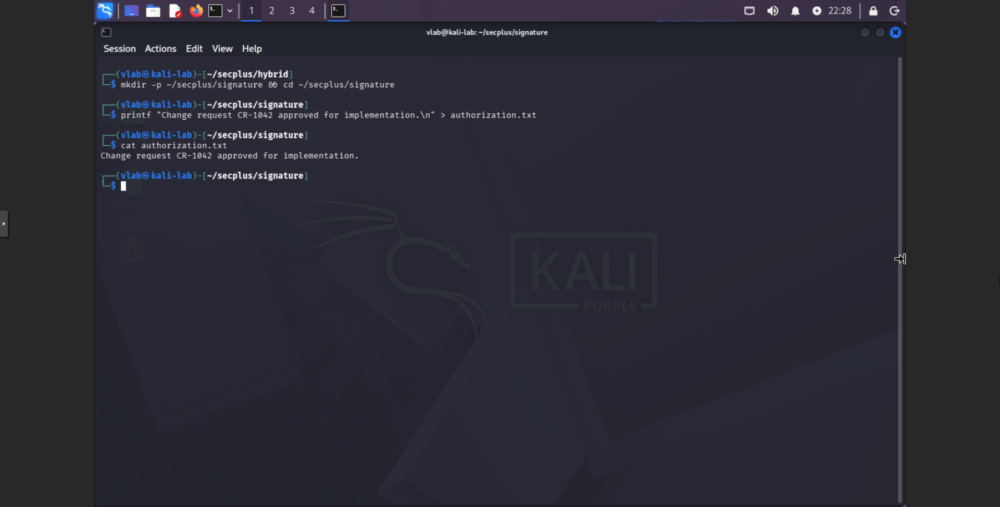

**Commands:**

```bash
mkdir -p ~/secplus/signature && cd ~/secplus/signature
printf 'Change request CR-1042 approved for implementation.\n' > authorization.txt
cat authorization.txt
```

The screenshot shows the document content before signing. It is a lab example and does not represent a real change approval.

### Step 2.2 - Create the signer's RSA key pair

Generate a 3072-bit RSA key pair and restrict the private-key file.

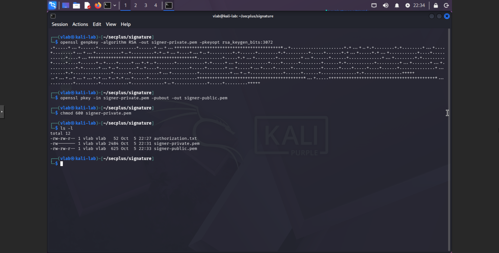

**Commands:**

```bash
openssl genpkey -algorithm RSA -out signer-private.pem -pkeyopt rsa_keygen_bits:3072
openssl pkey -in signer-private.pem -pubout -out signer-public.pem
chmod 600 signer-private.pem
ls -l
```

The file listing shows a separate private and public key file and owner-only permissions on signer-private.pem. The private-key material itself is not displayed.

### Step 2.3 - Create and inspect the signature

Sign the document with SHA-256 and inspect the binary signature with xxd.

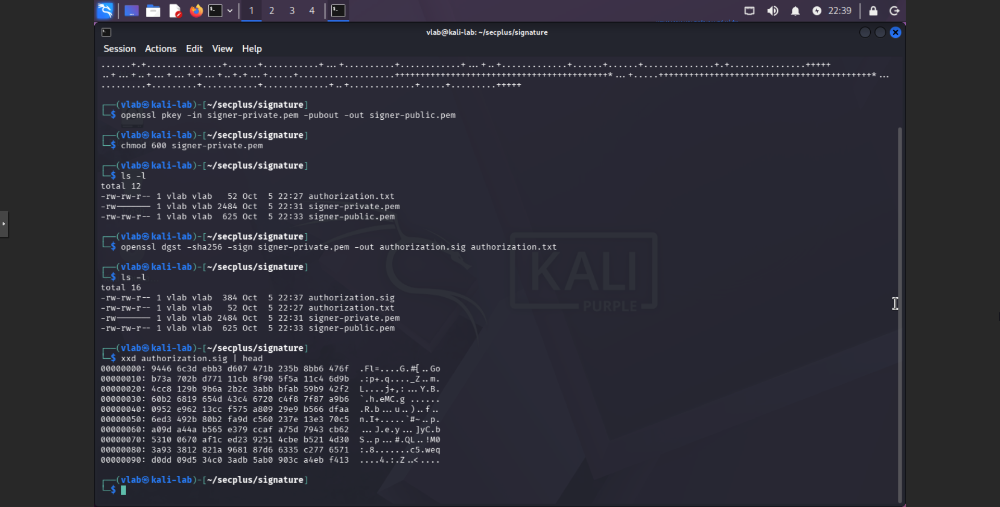

**Commands:**

```bash
openssl dgst -sha256 -sign signer-private.pem -out authorization.sig authorization.txt
xxd authorization.sig | head
```

OpenSSL signs the document digest with the private key. xxd displays the signature as hexadecimal bytes; the signature is not printed as text with cat.

### Step 2.4 - Verify the original document

Verify the signature against the unchanged document using the public key.

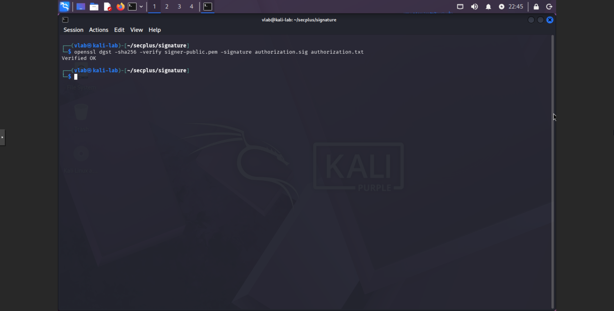

**Command:**

```bash
openssl dgst -sha256 -verify signer-public.pem -signature authorization.sig authorization.txt
```

Verified OK means the signature matches this document when checked with the supplied public key. The lab does not independently prove who controls that key or bind it to a verified real-world identity.

### Step 2.5 - Modify the document and verify again

Append text after signing and re-run the same verification.

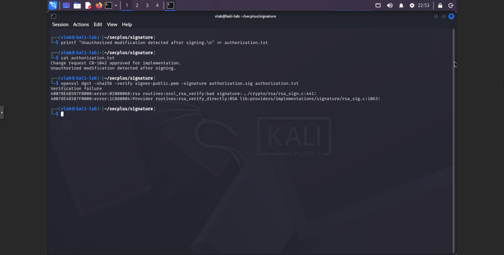

**Commands:**

```bash
printf 'Unauthorized modification detected after signing.\n' >> authorization.txt
cat authorization.txt
openssl dgst -sha256 -verify signer-public.pem -signature authorization.sig authorization.txt
```

OpenSSL reports **Verification failure** after the document changes. This is the expected negative result: the original signature no longer corresponds to the modified content.

A digital signature supports integrity checking and verification against a public key. It does not encrypt the document or provide confidentiality. Non-repudiation depends on reliable identity proofing and private-key custody beyond what this lab demonstrates.

## 3. Mini PKI

**Objective:** create a self-signed lab root, generate a server CSR, issue a server certificate from the root, and compare validation with and without the root of trust.

### Step 3.1 - Generate the Root CA private key

Create a 3072-bit RSA key for the lab CA and set owner-only permissions.

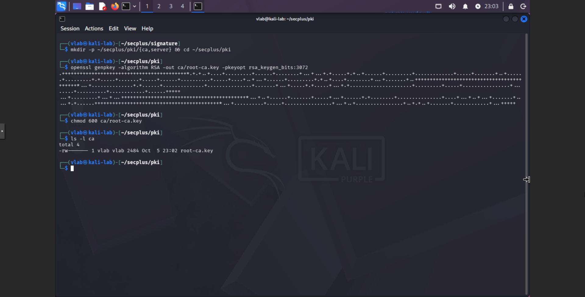

**Commands:**

```bash
mkdir -p ~/secplus/pki/{ca,server} && cd ~/secplus/pki
openssl genpkey -algorithm RSA -out ca/root-ca.key -pkeyopt rsa_keygen_bits:3072
chmod 600 ca/root-ca.key
ls -l ca
```

The file listing shows root-ca.key with mode 600. The screenshot documents the key file and permissions, not the private-key contents.

### Step 3.2 - Create the self-signed Root CA certificate

Create a self-signed certificate for the lab trust anchor and inspect its subject and issuer.

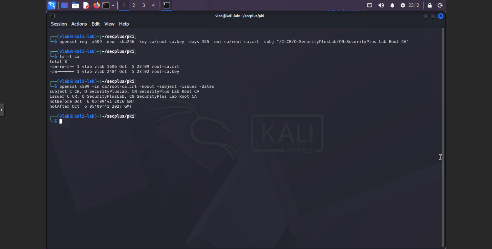

**Commands:**

```bash
openssl req -x509 -new -sha256 -key ca/root-ca.key -days 365 -out ca/root-ca.crt -subj "/C=CR/O=SecurityPlusLab/CN=SecurityPlus Lab Root CA"
ls -l ca/
openssl x509 -in ca/root-ca.crt -noout -subject -issuer -dates
```

The displayed Subject and Issuer both identify SecurityPlus Lab Root CA, so this certificate is self-signed. A self-signed root can serve as a trust anchor; self-signing does not make it inherently malicious or prevent it from being used for cryptography. Clients trust it only when they accept it as a trust anchor.

### Step 3.3 - Generate the server private key

Create a separate 2048-bit RSA key for the server and restrict access.

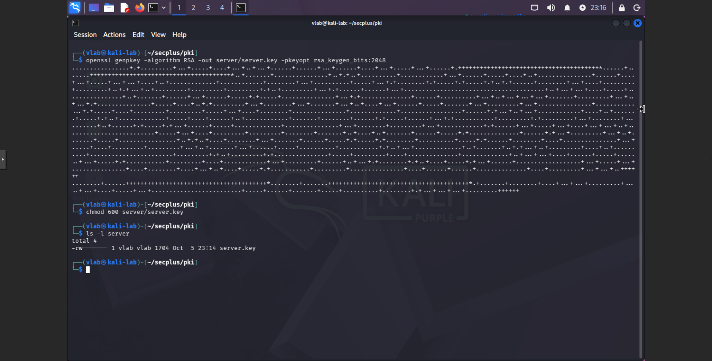

**Commands:**

```bash
openssl genpkey -algorithm RSA -out server/server.key -pkeyopt rsa_keygen_bits:2048
chmod 600 server/server.key
ls -l server/
```

The screenshot shows server.key with owner-only permissions. The server private key remains in the lab workspace; it is not included in the CSR or repository.

### Step 3.4 - Generate the server CSR

Create a certificate signing request using the server private key and the web.lab.local subject.

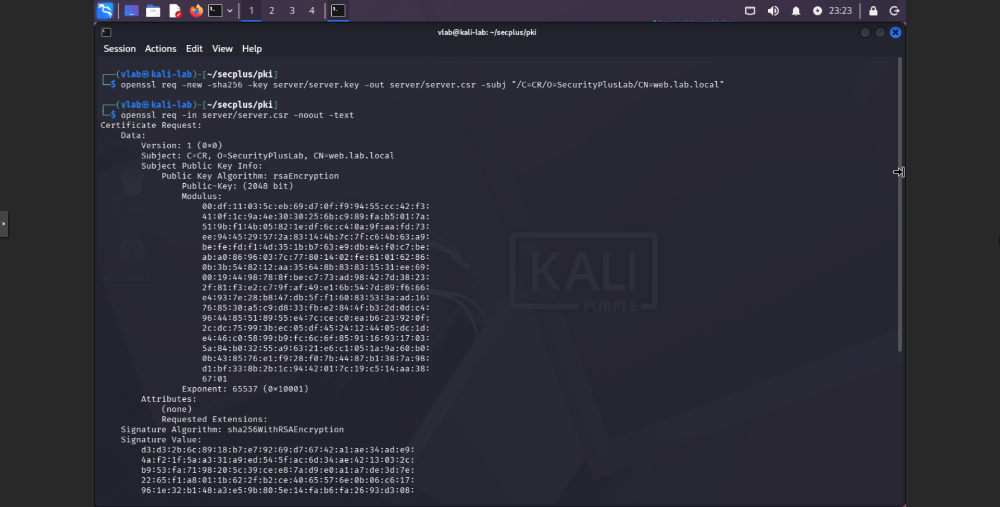

**Command:**

```bash
openssl req -new -sha256 -key server/server.key -out server/server.csr -subj "/C=CR/O=SecurityPlusLab/CN=web.lab.local"
```

The CSR requests a certificate for the stated subject and includes the corresponding public key. The private key is used locally to create the request and is not sent as part of it.

### Step 3.5 - Inspect the CSR contents

Inspect the request and confirm the subject and public-key information.

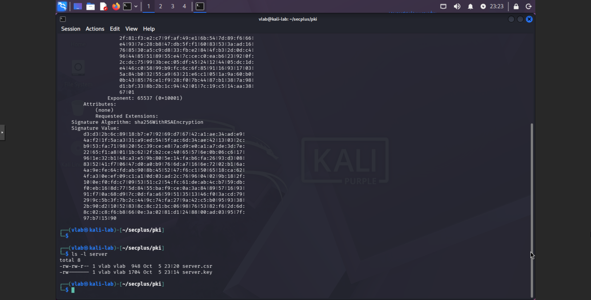

**Commands:**

```bash
openssl req -in server/server.csr -noout -text
ls -l server/
```

The output shows the subject and RSA public-key information. The file listing distinguishes server.csr from server.key; the CSR contains the public key and request data, not the private key.

### Step 3.6 - Issue a server certificate from the Root CA

Have the lab Root CA sign the server CSR and write the resulting certificate.

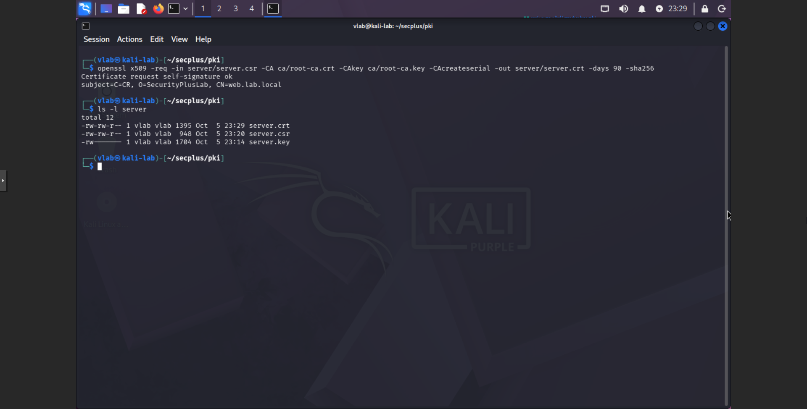

**Command:**

```bash
openssl x509 -req -in server/server.csr -CA ca/root-ca.crt -CAkey ca/root-ca.key -CAcreateserial -out server/server.crt -days 90 -sha256
```

The screenshot shows the issued server.crt and its subject. OpenSSL's message **Certificate request self-signature ok** refers to checking the CSR's proof-of-possession signature; server.crt is issued by the Lab Root CA and is not self-signed.

### Step 3.7 - Inspect the issued certificate

Review the server certificate's subject, issuer, validity dates, serial number, and SHA-256 fingerprint.

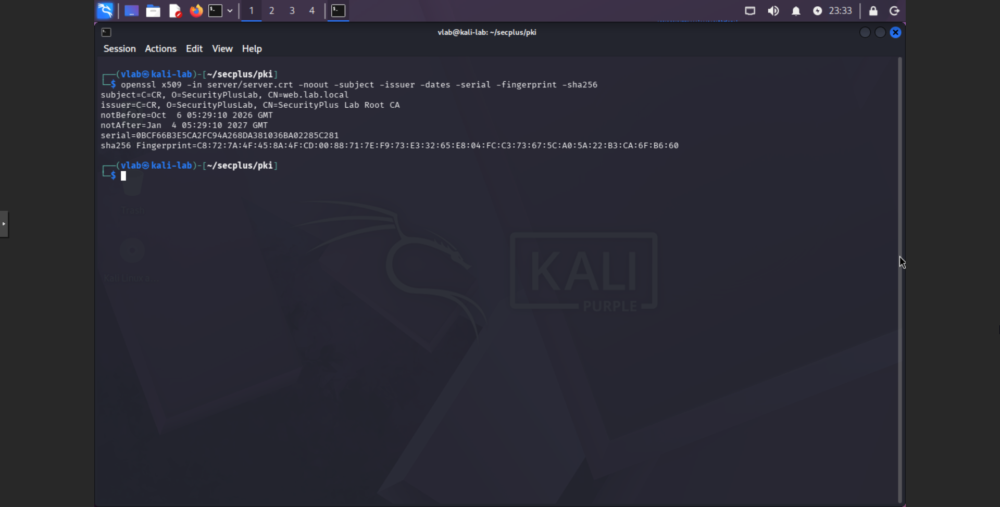

**Command:**

```bash
openssl x509 -in server/server.crt -noout -subject -issuer -dates -serial -fingerprint -sha256
```

The output distinguishes the server identity in Subject from the issuing authority in Issuer and displays the certificate metadata. This inspection does not test hostname matching or revocation status.

### Step 3.8 - Validate with and without the lab root

Run chain verification once with the Root CA explicitly supplied and once without it.

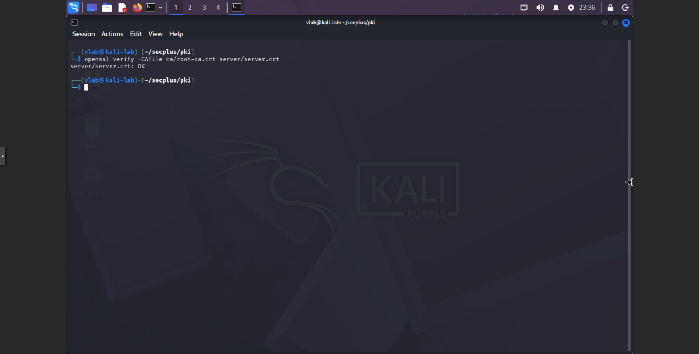

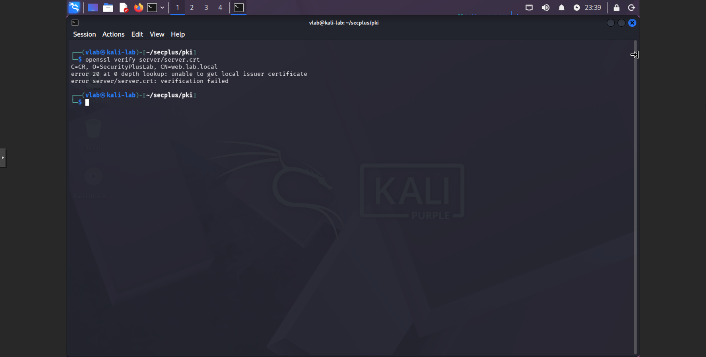

**Commands:**

```bash
openssl verify -CAfile ca/root-ca.crt server/server.crt
openssl verify server/server.crt
```

With -CAfile ca/root-ca.crt, OpenSSL reports **server/server.crt: OK**. Without the lab root, verification reports that it cannot get the local issuer certificate. The certificate can be correctly issued yet remain untrusted to a verifier that does not accept its issuing root. These results do not show the root installed in Kali's system trust store.

This phase distinguishes a self-signed trust anchor from a CA-issued server certificate. Certificate signatures can be checked, but client trust depends on an accepted chain to a trusted root.

## 4. Salt and Key Stretching

**Objective:** observe how a unique random salt changes PBKDF2-derived values and how increasing the iteration count changes measured computation time.

### Step 4.1 - Create and review the PBKDF2 script

Create the Python script in the hashing workspace and review its implementation.

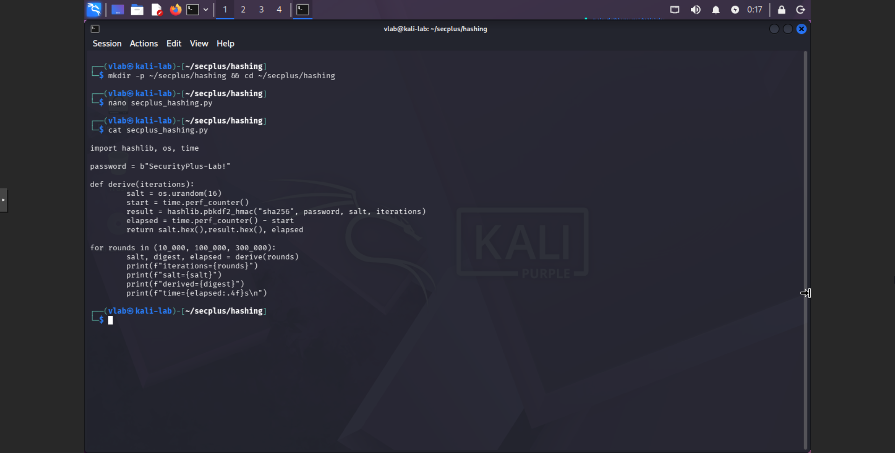

**Commands:**

```bash
mkdir -p ~/secplus/hashing && cd ~/secplus/hashing
nano secplus_hashing.py
cat secplus_hashing.py
```

The captured script uses os.urandom(16) for salt generation, hashlib.pbkdf2_hmac("sha256", ...) for derivation, and time.perf_counter() for timing. Its fixed input is a lab-only test value, not a real or reusable account password.

### Step 4.2 - Compare salts, derived values, and iteration cost

Run the script for 10,000, 100,000, and 300,000 PBKDF2 iterations.

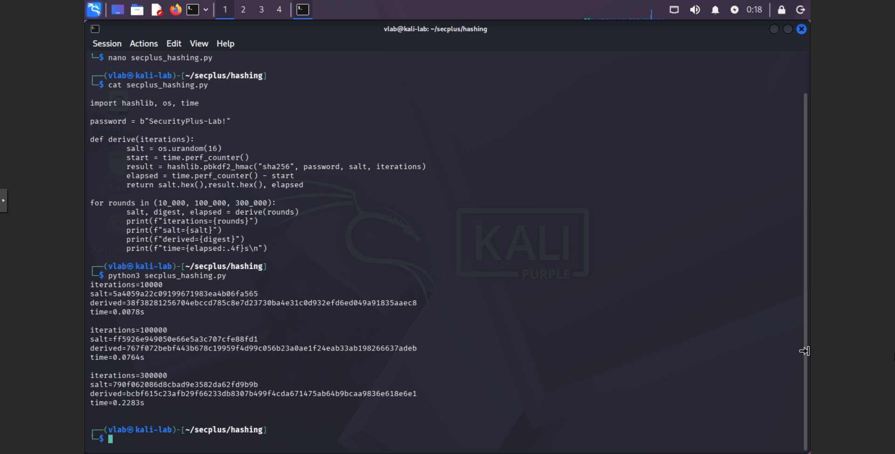

**Command:**

```bash
python3 secplus_hashing.py
```

The captured run shows distinct salts and derived values for the same fixed lab input. The displayed elapsed times were approximately:

| PBKDF2 iterations | Observed time |
|---:|---:|
| 10,000 | 0.0078 s |
| 100,000 | 0.0764 s |
| 300,000 | 0.2283 s |

A salt is not a secret; a unique random salt helps prevent equal passwords from producing equal derived values and reduces the usefulness of precomputed tables. More PBKDF2 iterations increase work per attempt, but also increase legitimate computation time. These timings describe this lab run only and are not universal benchmarks.

This phase separates two related ideas: salting makes repeated inputs produce distinct derived values, while key stretching raises the cost of each derivation.

## Security+ Concept Mapping

This mapping covers the cryptographic techniques practiced and evidenced in this lab; it does not claim coverage of every Objective 1.4 topic.

| Lab evidence | Objective 1.4 concept | What the evidence supports |
|---|---|---|
| AES-256-CBC payload plus RSA-OAEP-protected session secret | Symmetric and asymmetric encryption; hybrid encryption; confidentiality | AES protects the sample file, while the recipient's public/private key pair protects and recovers the small session secret. |
| Original signature verifies; modified document fails verification | SHA-256, digital signatures, integrity, authenticity | The supplied public key verifies the signature over unchanged content. The lab does not establish a real-world identity binding or legal non-repudiation. |
| Root CA, CSR, issued server certificate, Subject/Issuer, verification with and without the root | PKI, CA, CSR, certificate, root of trust, chain of trust | A certificate issued by the lab CA verifies when that root is supplied; chain validation fails without it. |
| Distinct salts and PBKDF2 values at increasing iteration counts | Salt, password-based key derivation, key stretching, computational cost | Random salts produce different derived values for a repeated test input, and the measured cost increases with iterations. |

## Troubleshooting / Lessons Learned

- **Verification failure** after modifying authorization.txt is the expected result when the original signature is checked against changed content.
- **Unable to get local issuer certificate** is expected when OpenSSL is not given the lab trust anchor; it does not by itself mean the server certificate was self-signed or corrupted.
- OpenSSL's **Certificate request self-signature ok** message concerns the CSR. The server certificate was signed by the Lab Root CA.
- A digital signature does not hide document contents. Encryption is needed for confidentiality.
- PBKDF2 timings vary by CPU, runtime, and system load. The relative increase observed in this run is not a universal timing guarantee.

## Observed Final State

- Ubuntu recovered the sample plaintext after receiving message.enc and session.pass.enc; the displayed text matches the original message.
- The original authorization document verified with its signature; the modified document did not.
- The Root CA certificate is self-signed. The server certificate identifies the lab CA as Issuer and verifies when that root is explicitly supplied.
- PBKDF2 produced distinct salts and derived values at 10,000, 100,000, and 300,000 iterations; the measured time increased across the captured runs.
- The evidence directory contains screenshots only. No private-key files, .key files, plaintext session-secret files, or recovered session-secret files are included. One screenshot displays the fixed PBKDF2 input used only for this lab; it is not an actual account credential.

## Portfolio Summary

Hands-on Security+ SY0-701 cryptographic-solutions lab documenting AES and RSA hybrid file encryption, signature verification and tamper detection, a small PKI with CSR and CA-issued certificate validation, and salted PBKDF2 key stretching. Results are bounded to the screenshots: recovered test plaintext, successful and failed signature checks, trust validation with and without an explicit lab root, and environment-specific derivation timings.
