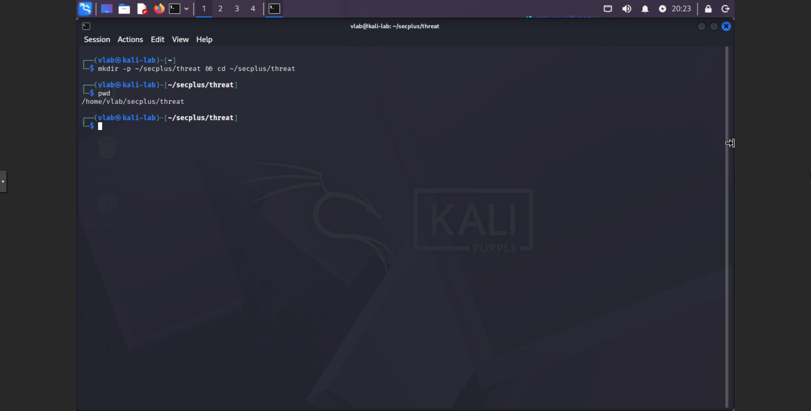
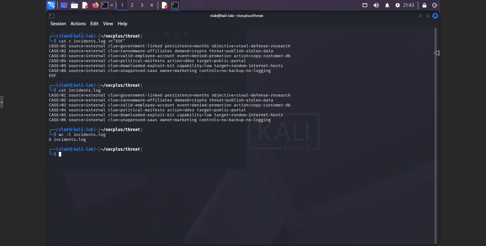
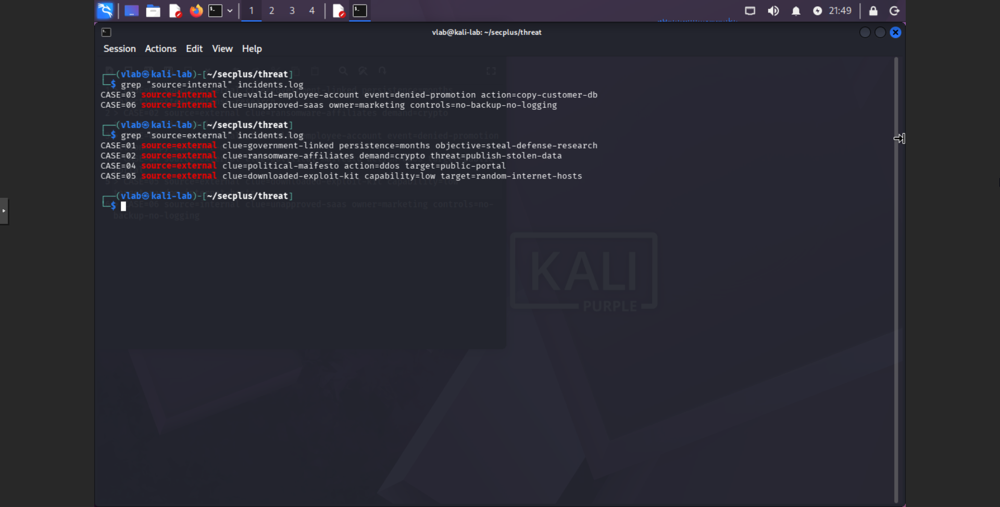
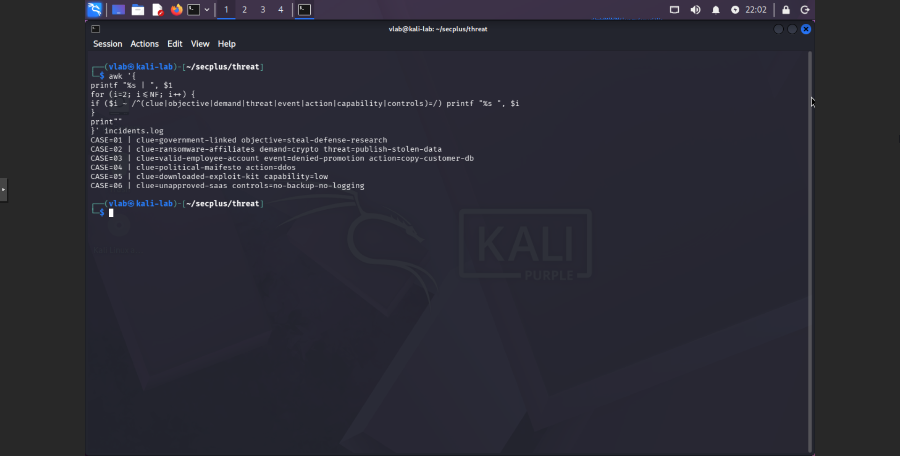
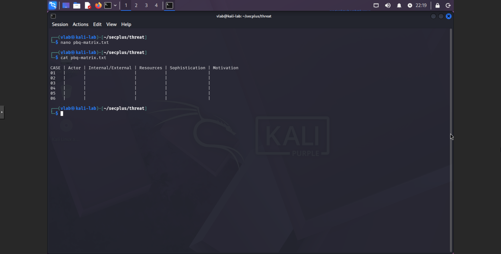
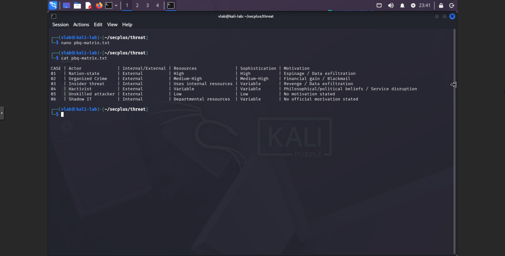

# Security+ Lab 2.1 - Threat Actors and Motivations

**CompTIA Security+ SY0-701 - Domain 2: Threats, Vulnerabilities, and Mitigations - Objective 2.1**

This lab documents an evidence-based classification exercise using six simulated incidents. Local text-processing commands identify actor attributes and incident clues, which are then used to complete a PBQ-style threat actor matrix. The activity analyzes a local dataset; it does not perform attacks or contact external targets.

## Lab Overview

- **Platform:** Kali Linux virtual machine
- **Workspace:** `~/secplus/threat`
- **Dataset:** `incidents.log`, containing six simulated incident records
- **Tools:** Bash, `grep`, `awk`, and `nano`
- **Workflow:** identify internal and external actor attributes, extract selected clues, then classify each case by actor, internal/external attribute, resources, sophistication, and supported motivation
- **Result:** all six cases were entered in a PBQ-style matrix, with motivations left unspecified where the incident evidence did not state one

## 1. Lab Workspace and Incident Dataset

**Objective:** create a local workspace and a consistent six-record dataset for the classification steps that follow.

### Step 1.1 - Create the lab workspace

Create and enter the directory used for this exercise, then check the current path.



**Commands:**

```bash
mkdir -p ~/secplus/threat && cd ~/secplus/threat
pwd
```

The directory is created if it does not already exist, and the shell changes into it. The `pwd` output in the evidence identifies the working path as `/home/vlab/secplus/threat`, which corresponds to `~/secplus/threat` for the lab account.

### Step 1.2 - Create the simulated incident records

Write six simulated incidents, one record per line, to `incidents.log`. Display the file and count its records to confirm the input dataset.



**Commands:**

```bash
cat > incidents.log <<'EOF'
CASE=01 source=external clue=government-linked persistence=months objective=steal-defense-research
CASE=02 source=external clue=ransomware-affiliates demand=crypto threat=publish-stolen-data
CASE=03 source=internal clue=valid-employee-account event=denied-promotion action=copy-customer-db
CASE=04 source=external clue=political-manifesto action=ddos target=public-portal
CASE=05 source=external clue=downloaded-exploit-kit capability=low target=random-internet-hosts
CASE=06 source=internal clue=unapproved-saas owner=marketing controls=no-backup-no-logging
EOF
cat incidents.log
wc -l incidents.log
```

The quoted here-document writes the six case records as plain text. The displayed contents and line count validate the dataset used in the later filters and classification; these are simulated clues, not observations of real incidents.

This phase establishes a reproducible local input and confirms that it contains six cases before analysis begins.

## 2. Internal and External Actor Attributes

**Objective:** separate incidents marked with an internal actor attribute from those marked external before assigning actor types or motivations.

### Step 2.1 - Filter incidents by source attribute

Use `grep` to display records marked `internal` and `external` in the `source` field.



**Commands:**

```bash
grep 'source=internal' incidents.log
grep 'source=external' incidents.log
```

The internal filter returns CASE 03 and CASE 06. The external filter returns CASE 01, CASE 02, CASE 04, and CASE 05. These labels describe an actor attribute in the scenario; they do not identify a specific actor type or establish a motivation.

This phase demonstrates how to isolate an attribute for analysis while keeping it distinct from the later actor and motivation classifications.

## 3. Incident Clue Extraction

**Objective:** display selected case clues in a compact form so each classification can be tied to fields present in the simulated records.

### Step 3.1 - Extract selected fields with `awk`

Print each case identifier followed by selected clue, objective, demand, threat, event, action, capability, or control fields.



**Command:**

```bash
awk '{ printf "%s | ", $1; for (i=2; i<=NF; i++) { if ($i ~ /^(clue|objective|demand|threat|event|action|capability|controls)=/) printf "%s ", $i } print "" }' incidents.log
```

The `awk` program treats each line as a record, prints the first field (`CASE=...`), then prints only fields whose names match the listed keys. The output preserves selected case clues in a concise view; it does not infer an actor identity or motivation on its own. For CASE 01, the extracted view shows `government-linked` and `steal-defense-research`. The original `incidents.log` record also contains `persistence=months`, so the final classification considers the extracted clues together with the source record.

This phase shows how structured text extraction can focus a review while keeping each interpretation traceable to the original record.

## 4. Threat Actor PBQ Classification

**Objective:** use the incident clues and the distinction between actor, attribute, resources, sophistication, and motivation to complete a classification matrix without adding unsupported conclusions.

### Step 4.1 - Review the blank PBQ matrix

Open the matrix template and display its fields before entering case classifications.



**Commands:**

```bash
nano pbq-matrix.txt
cat pbq-matrix.txt
```

The template provides a consistent place to classify each case. Keeping actor type, internal or external attribute, resources, sophistication, and motivation in separate fields helps prevent one clue from being mistaken for another.

### Step 4.2 - Complete the matrix from the available clues

Enter the evidence-supported classification for each case, then display the completed matrix for review.



**Commands:**

```bash
nano pbq-matrix.txt
cat pbq-matrix.txt
```

The completed matrix records the classifications shown in the evidence:

| Case | Threat actor | Attribute | Resources | Sophistication | Motivation |
|---|---|---|---|---|---|
| CASE 01 | Nation-state | External | High | High | Espionage / Data exfiltration |
| CASE 02 | Organized crime | External | Medium-High | Medium-High | Financial gain / Blackmail |
| CASE 03 | Insider threat | Internal | Uses internal resources | Variable | Revenge / Data exfiltration |
| CASE 04 | Hacktivist | External | Variable | Variable | Philosophical/political beliefs / Service disruption |
| CASE 05 | Unskilled attacker | External | Low | Low | No motivation stated |
| CASE 06 | Shadow IT | Internal | Departmental resources | Variable | No official motivation stated |

The classifications rely on the combination of clues, not on a single attribute:

- **CASE 01:** government linkage, months of persistence, and a defense-research objective support the nation-state and espionage/data-exfiltration classification. High resources and sophistication are consistent with the scenario but would not establish a nation-state by themselves.
- **CASE 02:** ransomware affiliates, a cryptocurrency demand, and a threat to publish stolen data support organized crime, financial gain, and blackmail. Resources and sophistication can vary among criminal groups.
- **CASE 03:** the employee relationship, denied-promotion event, and attempted customer-database copying support an insider-threat scenario and the listed revenge/data-exfiltration motivation. An internal attribute describes the scenario and does not mean the account must be used from inside the organization; a valid employee account alone would not prove that the employee was the actor if account compromise were possible.
- **CASE 04:** the political manifesto supports the Hacktivist classification and Philosophical/political beliefs motivation. The DDoS action supports Service disruption, but DDoS alone would not identify the actor type.
- **CASE 05:** the downloaded exploit kit and explicitly low capability support the unskilled-attacker classification. The record provides no motivation, so none is inferred.
- **CASE 06:** unapproved SaaS introduced by a marketing owner, together with missing backup and logging controls, supports Shadow IT. The record does not establish malicious intent or state an official motivation; the control gaps describe risk, not motive.

This phase demonstrates evidence-based PBQ reasoning: actor identity, actor attributes, capability, resources, and motivation are related but distinct, and an unknown motivation should remain unstated when the record does not support one.

## Observed Final State

- The working directory used for the exercise was `~/secplus/threat`.
- `incidents.log` contained six simulated records, and the line count was verified.
- The `grep` filters returned two internal and four external cases.
- The `awk` command displayed selected classification clues for all six cases.
- The PBQ matrix was completed with actor, attribute, resources, sophistication, and motivation fields.
- CASE 05 and CASE 06 were left without an invented official motivation.
- The exercise remained a local analysis of simulated records; no attack or external-target activity was performed.

## Security+ Concept Mapping

| Lab evidence | Security+ concept | What the evidence demonstrates |
|---|---|---|
| `source=internal` and `source=external` filters | Actor attributes | Internal/external describes an attribute and does not, by itself, identify an actor type or motive. |
| CASE 01 government linkage, persistence, and research objective | Nation-state; espionage; data exfiltration | Multiple scenario clues support the classification; sophistication alone is not conclusive. |
| CASE 02 ransomware affiliates, crypto demand, and leak threat | Organized crime; financial gain; blackmail | The demand and threat support the stated criminal motivation. |
| CASE 03 employee context, denied promotion, and database-copy action | Insider threat; revenge; data exfiltration | A trusted relationship and scenario context inform the classification; internal does not require physical presence. |
| CASE 04 political manifesto and DDoS action | Hacktivist; philosophical/political beliefs; service disruption | The manifesto supplies ideological context that DDoS alone would not provide. |
| CASE 05 exploit-kit clue and low capability | Unskilled attacker | The classification follows the supplied capability clue; no motivation is stated. |
| CASE 06 unapproved SaaS and control gaps | Shadow IT | Unapproved technology can create risk without evidence of malicious intent or an official motive. |

## Portfolio Summary

This lab documents a reproducible way to review simulated incident records, distinguish actor attributes from actor types and motivations, extract relevant clues with shell tools, and complete a threat actor PBQ matrix. The classifications preserve uncertainty where the evidence does not state a motivation and avoid treating any single indicator as conclusive.