# Security+ Lab 2.2 - Threat Vectors and Attack Surfaces

**CompTIA Security+ SY0-701 - Domain 2: Threats, Vulnerabilities, and Mitigations - Objective 2.2**

This lab documents three controlled exercises aligned with the objective to explain common threat vectors and attack surfaces: network exposure assessment, simulated social-engineering message triage, and passive inspection of benign files. The network tests were performed between lab virtual machines. The message scenarios were simulated, and the files were created for the exercise; no exploitation, real phishing, external website access, or script execution was performed.

## Lab Overview

- **Systems:** Kali Linux (`172.16.40.104`), Ubuntu Server (`172.16.40.20`), and Windows 11 (`172.16.40.106`)
- **Kali workspaces:** `~/secplus/attack-surface`, `~/secplus/attack-surface/message-triage`, and `~/secplus/attack-surface/files`
- **Tools:** Nmap, `curl`, `ss`, `systemctl`, Windows PowerShell, Windows Defender Firewall, `file`, `sha256sum`, `zip`, `unzip`, and `sed`
- **Exercises:** compare reachable services before and after a service shutdown and firewall rule; classify six simulated messages by channel, vector, and technique; inspect three locally created files without executing them
- **Observed result:** Ubuntu TCP/80 changed from open to closed after Nginx was stopped. Windows TCP/7680 changed from open to filtered from Kali while the Windows socket remained in the Listen state. The message matrix was completed, and the benign files were identified, hashed, listed, and reviewed passively.

## 1. Network Attack Surface Assessment

**Objective:** identify TCP services observable from another lab system, compare remote scan results with local listeners, and observe how service shutdown and firewall filtering change network exposure.

### Step 1.1 - Prepare Kali and verify connectivity to Ubuntu

Create the Kali workspace, inspect its IPv4 interface, and send three ICMP requests to the Ubuntu host.

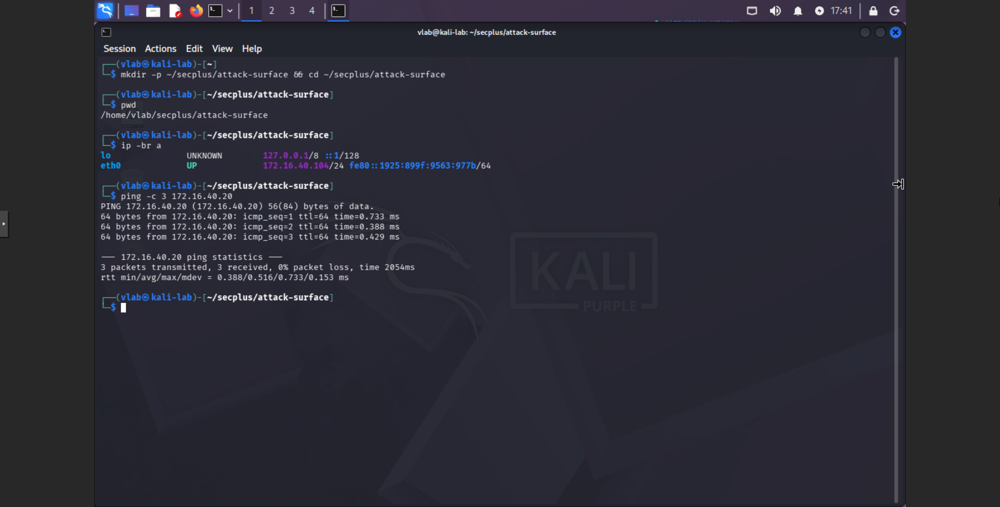

**Commands:**

```bash
mkdir -p ~/secplus/attack-surface && cd ~/secplus/attack-surface
pwd
ip -br a
ping -c 3 172.16.40.20
```

The `pwd` output shows `/home/vlab/secplus/attack-surface`. The `eth0` interface is up with `172.16.40.104/24`, and the ping received three replies with no packet loss. This establishes the source and basic reachability for the following tests.

### Step 1.2 - Scan Ubuntu's baseline TCP exposure

From Kali, run a TCP connect scan against the Ubuntu address before changing its services.

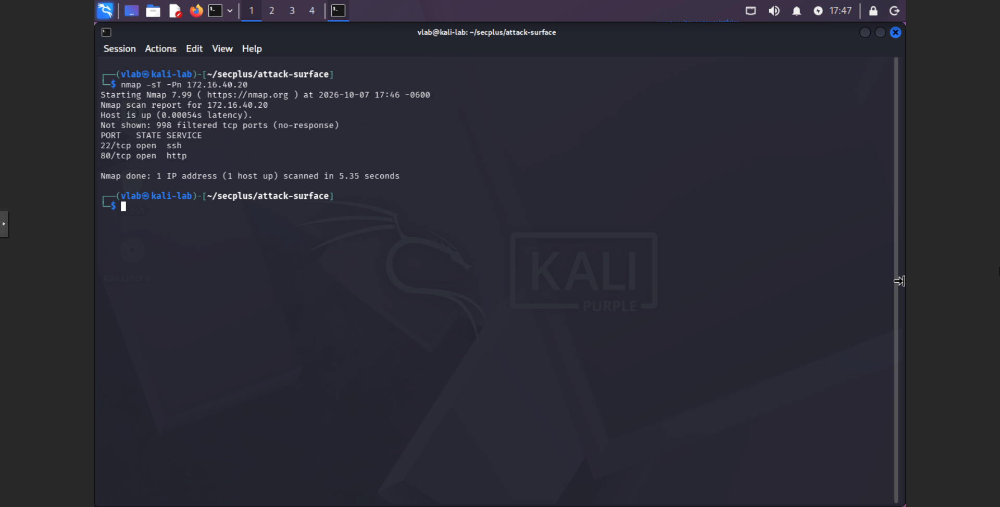

**Command:**

```bash
nmap -sT -Pn 172.16.40.20
```

The output reports `22/tcp open ssh` and `80/tcp open http`; it also reports 998 filtered TCP ports with no response in the scan. An `open` state means a TCP connection to that port was accepted. The `SERVICE` values are Nmap's port-to-service labels, not a verified process identity or a vulnerability finding. Because `-Pn` skips normal host discovery, the displayed host-up status is not independent host-discovery evidence.

### Step 1.3 - Inspect Ubuntu's local listeners

On Ubuntu, inspect the local TCP listening sockets and the processes associated with them.

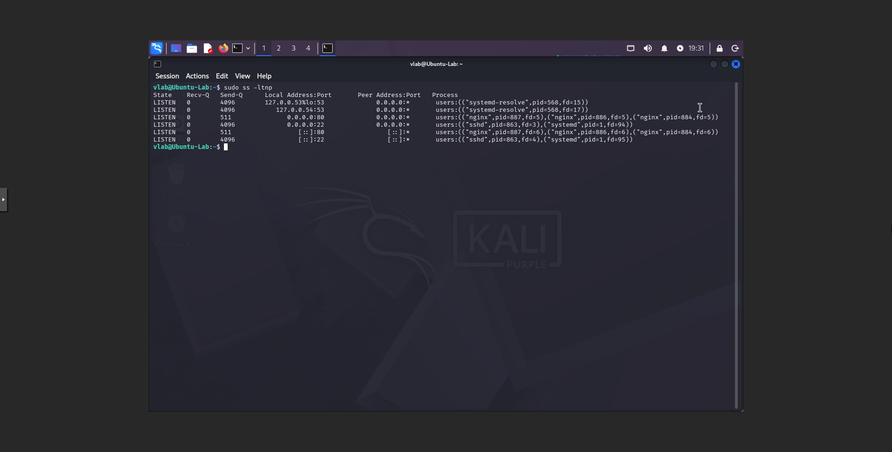

**Command:**

```bash
sudo ss -ltnp
```

The Ubuntu output shows Nginx listening on TCP/80 and `sshd` listening on TCP/22, including wildcard IPv4 and IPv6 addresses. This is host-side listener information from Ubuntu; it is not output from Kali. Comparing it with Nmap shows which local listeners were observable from the tested Kali path.

### Step 1.4 - Verify Ubuntu's HTTP response

From Kali, scan only TCP/80 and request the HTTP response headers from Ubuntu.

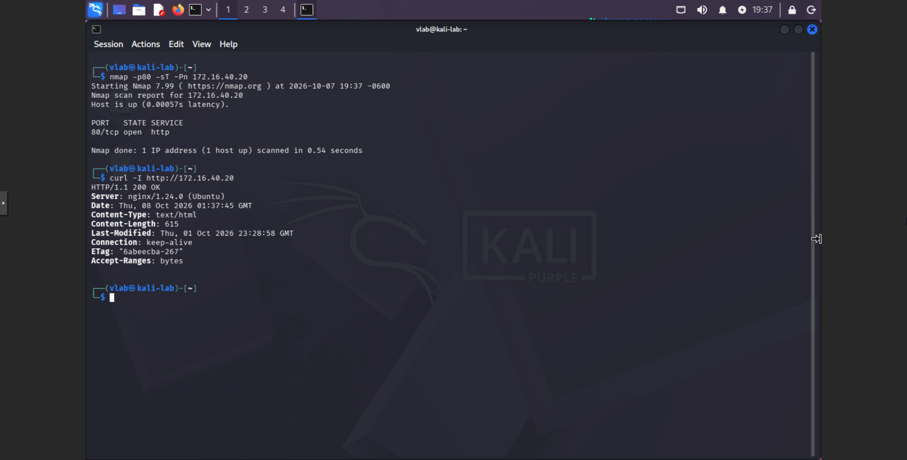

**Commands:**

```bash
nmap -p80 -sT -Pn 172.16.40.20
curl -I http://172.16.40.20
```

The scan reports `80/tcp open http`. `curl` receives `HTTP/1.1 200 OK` and the header `Server: nginx/1.24.0 (Ubuntu)`. Together, these results confirm that the tested client could connect to TCP/80 and receive an HTTP response from Nginx at that time.

### Step 1.5 - Stop and disable Nginx on Ubuntu

Stop Nginx and disable its automatic startup, then inspect the unit state on Ubuntu.

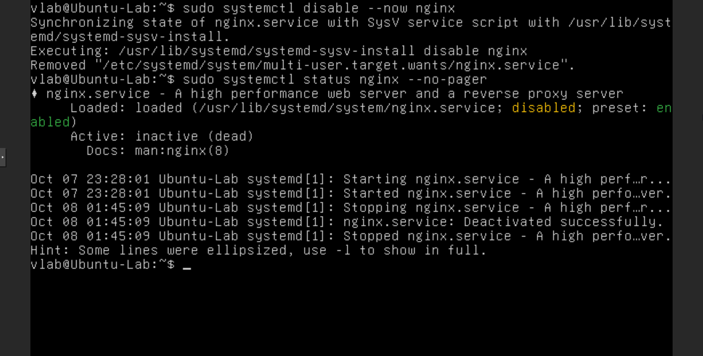

**Commands:**

```bash
sudo systemctl disable --now nginx
sudo systemctl status nginx --no-pager
```

`disable --now` both removes the service's automatic enablement and stops the running service. The status output shows `disabled` and `Active: inactive (dead)`. This removes the listener by stopping the service; it is different from leaving a service running and filtering network access with a firewall.

### Step 1.6 - Test HTTP after Nginx is stopped

From Kali, repeat the TCP/80 scan and HTTP request after the Ubuntu service change.

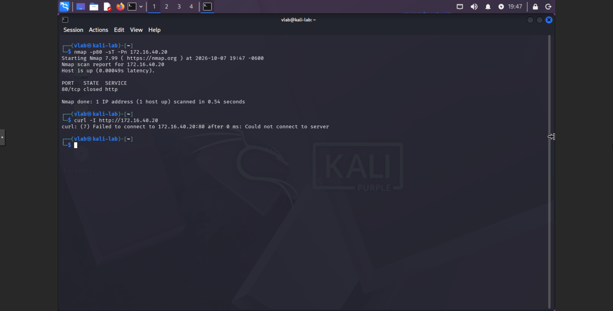

**Commands:**

```bash
nmap -p80 -sT -Pn 172.16.40.20
curl -I http://172.16.40.20
```

Nmap now reports `80/tcp closed http`, and `curl` reports that it could not connect. In this observation, `closed` indicates that the tested host responded but no application accepted the TCP connection on port 80. This is distinct from a `filtered` state.

### Step 1.7 - Re-scan Ubuntu after reducing its service exposure

Run the broader scan again to compare TCP/22, TCP/80, and the other ports reported by the scan.

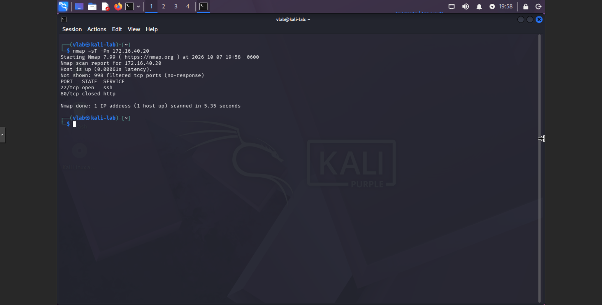

**Command:**

```bash
nmap -sT -Pn 172.16.40.20
```

The output shows `22/tcp open ssh`, `80/tcp closed http`, and 998 filtered TCP ports with no response. This confirms the observed change to TCP/80 while SSH remained open in this scan. It describes the scan's port set and Kali's path at that time; it does not establish the state of every port or prove that Ubuntu has no vulnerabilities.

### Step 1.8 - Confirm the Windows lab address

On Windows, display the non-loopback IPv4 interface address before testing its listeners from Kali.

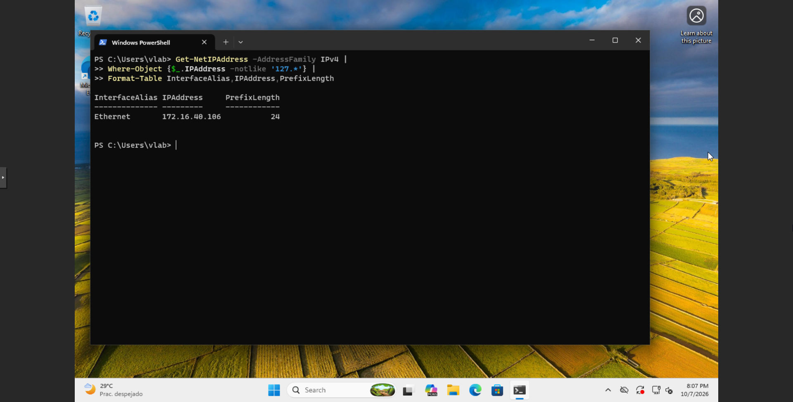

**Command:**

```powershell
Get-NetIPAddress -AddressFamily IPv4 | Where-Object {$_.IPAddress -notlike '127.*'} | Format-Table InterfaceAlias,IPAddress,PrefixLength
```

The output identifies the Windows Ethernet address as `172.16.40.106/24`. This is the target address used in the subsequent scan.

### Step 1.9 - Inspect Windows TCP listeners

On Windows, list TCP connections in the `Listen` state, sorted by local port.

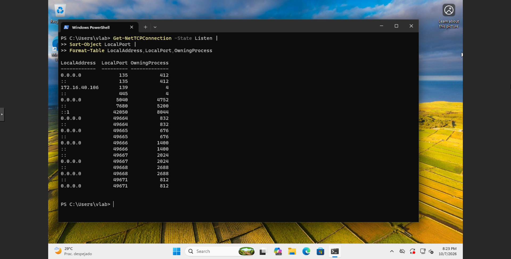

**Command:**

```powershell
Get-NetTCPConnection -State Listen | Sort-Object LocalPort | Format-Table LocalAddress,LocalPort,OwningProcess
```

The local output includes ports `135`, `139`, `445`, `5040`, `7680`, `49664` through `49668`, and `49671`. It also shows TCP/42050 bound to the IPv6 loopback address `::1`. A local listening socket indicates a service has bound a local address; it does not prove that the socket is reachable from Kali or any other remote source.

### Step 1.10 - Scan selected Windows ports from Kali

Scan the selected listener ports from Kali and request Nmap's reason for each reported state.

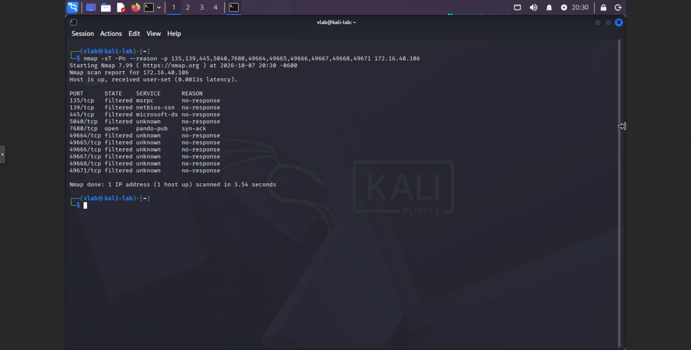

**Command:**

```bash
nmap -sT -Pn --reason -p 135,139,445,5040,7680,49664,49665,49666,49667,49668,49671 172.16.40.106
```

The scan reports `7680/tcp open pando-pub` with reason `syn-ack`. The other selected ports are `filtered` with reason `no-response`. `pando-pub` is Nmap's service label for the port, not evidence of the Windows process or service using it. As with the Ubuntu scans, `-Pn` skips normal host discovery, so Nmap's `received user-set` host-up status should not be treated as separate availability validation. A filtered result is not the same as closed, and it does not by itself establish which device or control caused the lack of response.

### Step 1.11 - Identify the Windows service associated with PID 5200

Use Windows service data to map the owning process ID reported for TCP/7680 to a service.

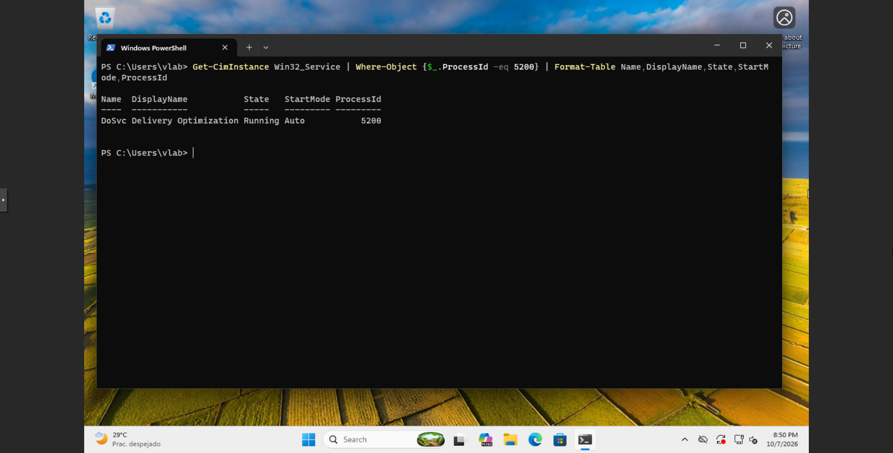

**Command:**

```powershell
Get-CimInstance Win32_Service | Where-Object {$_.ProcessId -eq 5200} | Format-Table Name,DisplayName,State,StartMode,ProcessId
```

Windows reports `DoSvc`, display name `Delivery Optimization`, state `Running`, start mode `Auto`, and process ID `5200`. This host-side process and service mapping is stronger evidence of the local service identity than Nmap's `pando-pub` port label.

### Step 1.12 - Create and verify the temporary inbound block rule

On Windows, create a named inbound TCP block rule for local port 7680 and display its rule properties.

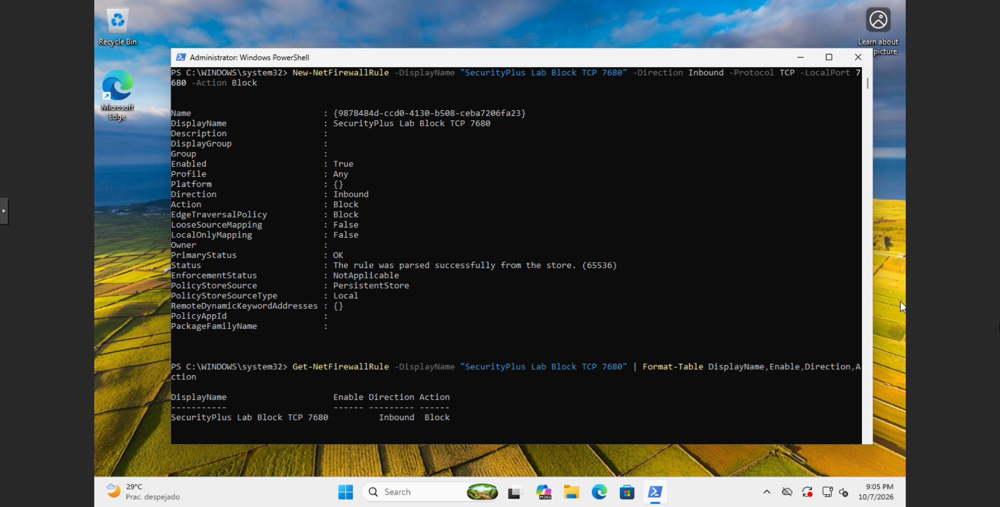

**Commands:**

```powershell
New-NetFirewallRule -DisplayName "SecurityPlus Lab Block TCP 7680" -Direction Inbound -Protocol TCP -LocalPort 7680 -Action Block
Get-NetFirewallRule -DisplayName "SecurityPlus Lab Block TCP 7680" | Format-Table DisplayName,Enabled,Direction,Action
```

The creation command specifies inbound TCP/7680 traffic and the `Block` action. The rule output shows the named rule enabled with direction `Inbound` and action `Block`. The evidence documents the final verified rule configuration after the reported duplicate-rule cleanup.

### Step 1.13 - Re-test TCP/7680 from Kali

Repeat the targeted scan from Kali after enabling the Windows firewall rule.

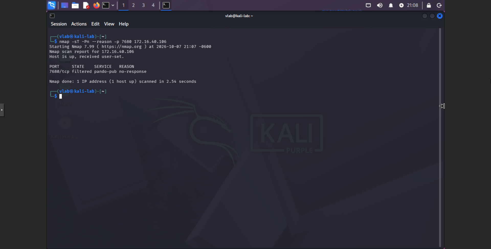

**Command:**

```bash
nmap -sT -Pn --reason -p 7680 172.16.40.106
```

The result changes from `7680/tcp open` to `7680/tcp filtered`, with reason `no-response`. In conjunction with the enabled rule shown in Step 1.12, this is consistent with the configured firewall filter affecting the tested path from Kali. The `filtered` state alone does not identify the cause or prove the port is unreachable from every source.

### Step 1.14 - Confirm TCP/7680 remains locally listening

On Windows, check the local state of TCP/7680 after the remote scan reports it filtered.

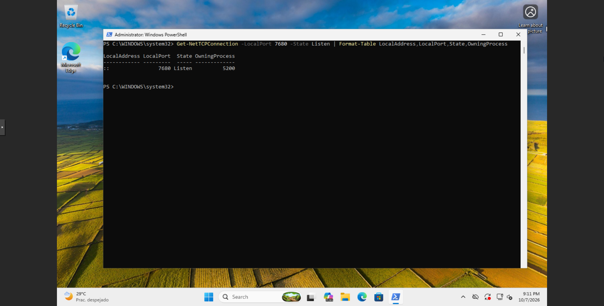

**Command:**

```powershell
Get-NetTCPConnection -LocalPort 7680 -State Listen | Format-Table LocalAddress,LocalPort,State,OwningProcess
```

Windows still reports local address `::`, port `7680`, state `Listen`, and owning process `5200`. The service remained locally listening while Kali observed the port as filtered. The result demonstrates a difference between local service state and reachability over the tested network path.

This phase shows two distinct ways to change observed exposure: stopping Nginx made TCP/80 appear closed, while the Windows rule changed TCP/7680 to filtered without stopping its listener. These results apply to the tested systems, ports, and Kali path; they do not establish the state of all interfaces or prove that either host is secure.

## 2. Phishing and BEC Message Triage

**Objective:** classify six simulated social-engineering scenarios by channel, vector, technique, decisive clue, and safe response without interacting with real messages, links, or websites.

### Step 2.1 - Create the message-triage workspace

Create the workspace under the main Kali lab directory and confirm its path.

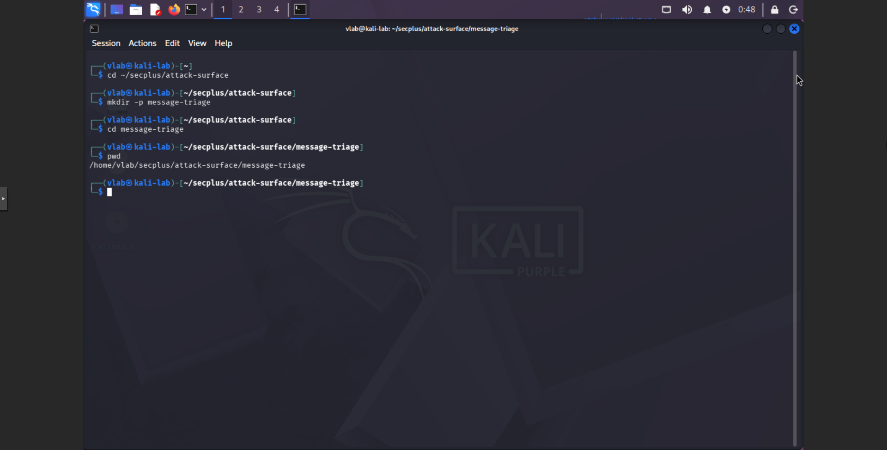

**Commands:**

```bash
cd ~/secplus/attack-surface
mkdir -p message-triage
cd message-triage
pwd
```

The output confirms the working directory is `/home/vlab/secplus/attack-surface/message-triage`.

### Step 2.2 - Review the blank triage matrix

Create the matrix template with columns for the case, channel, vector, technique, decisive clue, and safe action.

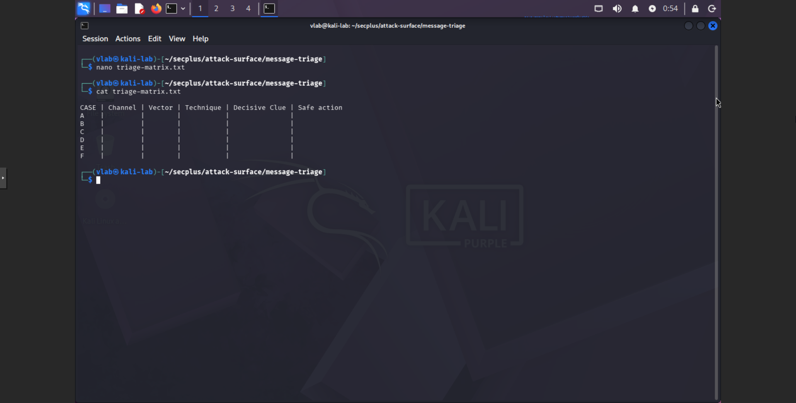

**Commands:**

```bash
nano triage-matrix.txt
cat triage-matrix.txt
```

The displayed template has rows for cases A through F. Keeping channel, vector, and technique in separate columns supports consistent classification rather than treating them as interchangeable terms.

### Step 2.3 - Complete the six simulated message classifications

Enter the classifications in the matrix and display the completed results.

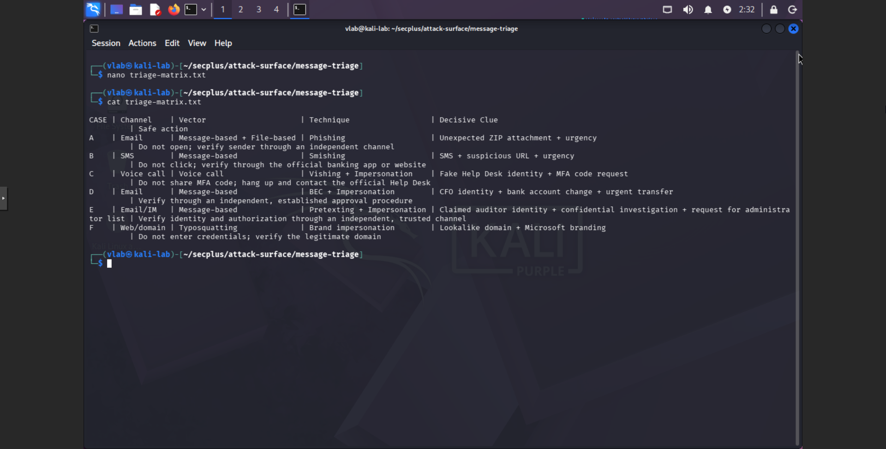

**Commands:**

```bash
nano triage-matrix.txt
cat triage-matrix.txt
```

| Case | Channel | Vector | Technique | Decisive clue | Safe action |
|---|---|---|---|---|---|
| A | Email | Message-based + File-based | Phishing | Unexpected ZIP attachment + urgency | Do not open the attachment; verify the sender through an independent channel. |
| B | SMS | Message-based | Smishing | Suspicious URL + urgency | Do not click the link; use the official banking app or website. |
| C | Voice call | Voice call | Vishing + Impersonation | Fake Help Desk identity + MFA code request | Do not share the MFA code; contact the official Help Desk. |
| D | Email | Message-based | BEC + Impersonation | Claimed CFO identity + bank account change + urgent transfer | Verify through an independent, established approval procedure. |
| E | Email/IM | Message-based | Pretexting + Impersonation | Claimed auditor identity + confidential investigation + administrator-list request | Verify identity and authorization through an independent, trusted channel. |
| F | Web/domain | Typosquatting | Brand impersonation | Lookalike domain + Microsoft branding | Do not enter credentials; verify the legitimate domain. |

The matrix distinguishes the communication channel from the path or content used and the technique identified by the scenario. Phishing is the broader fraudulent-message technique; smishing uses SMS, and vishing uses voice. Impersonation is the false identity, while pretexting is the invented context used to make a request appear credible; both can occur together. The CFO scenario is BEC because it uses a business identity and urgent payment redirection, but the evidence does not establish that an actual mailbox was compromised. Typosquatting uses a lookalike domain, while brand impersonation copies a trusted brand's identity; case F includes both clues. Independent verification through a known, trusted channel avoids relying on contact details supplied by the suspicious message itself.

These cases were simulated training scenarios. No real phishing messages were received, no malicious website was visited, and the matrix records classification and safe response rather than interaction with the scenarios.

## 3. Safe File Inspection

**Objective:** use passive checks to identify, fingerprint, list, and review benign files created for the lab without executing the script or extracting the archive.

### Step 3.1 - Prepare the file-inspection workspace

Create and enter the Kali directory for the three sample files.

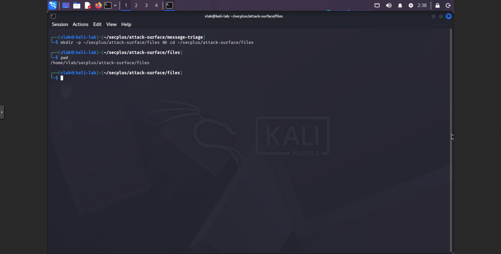

**Commands:**

```bash
mkdir -p ~/secplus/attack-surface/files && cd ~/secplus/attack-surface/files
pwd
```

The output shows `/home/vlab/secplus/attack-surface/files` as the working directory.

### Step 3.2 - Create benign sample files and the ZIP archive

Create a short text file, write a benign shell script, set its permissions to mode 644, and add both files to a ZIP archive.

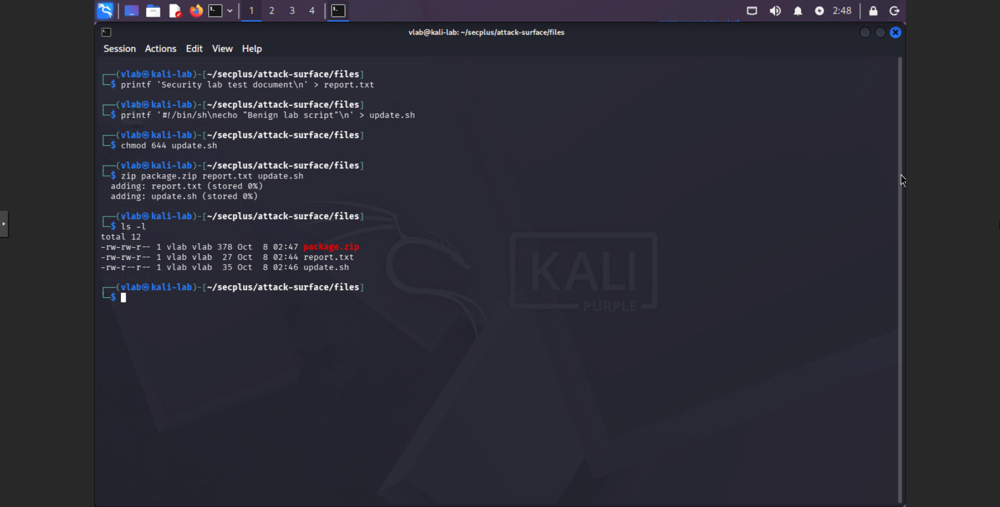

**Commands:**

```bash
printf 'Security lab test document\n' > report.txt
printf '#!/bin/sh\necho "Benign lab script"\n' > update.sh
chmod 644 update.sh
zip package.zip report.txt update.sh
ls -l
```

The listing shows `report.txt` at 27 bytes, `update.sh` at 35 bytes, and `package.zip` at 378 bytes. The mode for `update.sh` is `-rw-r--r--`, so its executable permission bit is not set. These are benign files created for the exercise.

### Step 3.3 - Identify the file types

Ask `file` to identify each sample based on its content and format.

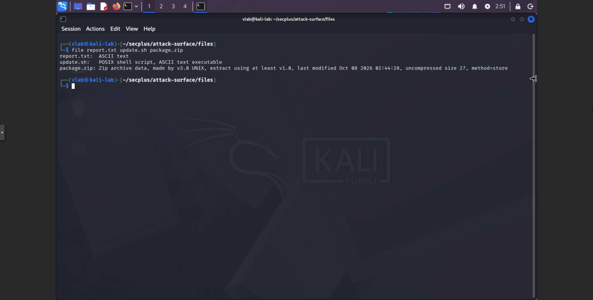

**Command:**

```bash
file report.txt update.sh package.zip
```

The output identifies `report.txt` as ASCII text, `update.sh` as a POSIX shell script and ASCII text executable, and `package.zip` as ZIP archive data. The `file` description for `update.sh` describes its recognized format; it does not mean the executable permission bit is enabled. The earlier `chmod 644` and file listing show that the execute bit was not set.

### Step 3.4 - Record SHA-256 fingerprints

Calculate and record the displayed SHA-256 value for each file.

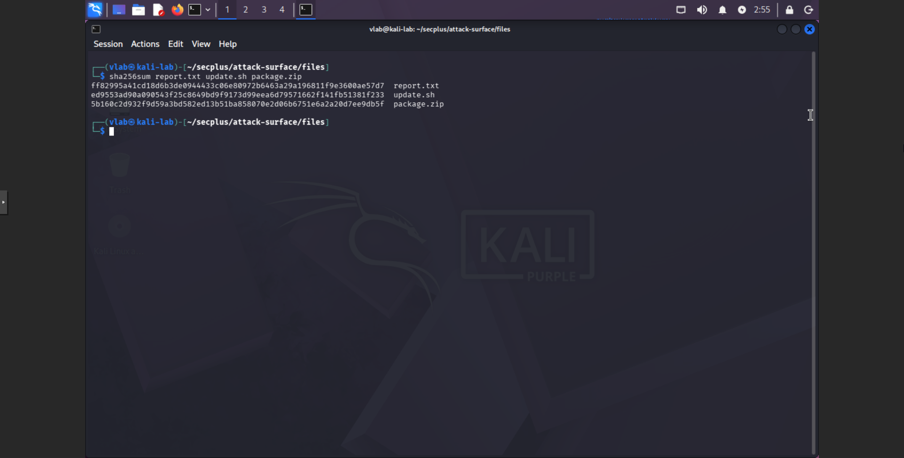

**Command:**

```bash
sha256sum report.txt update.sh package.zip
```

The screenshot records these values:

| File | SHA-256 shown in the lab |
|---|---|
| `report.txt` | `ff82995a41cd18d6b3de0944433c06e80972b6463a29a196811f9e3600ae57d7` |
| `update.sh` | `ed9553ad90a090543f25c8649bd9f9173d99eea6d79571662f141fb51381f233` |
| `package.zip` | `5b160c2d932f9d59a3bd582ed13b51ba858070e2d06b6751e6a2a20d7ee9db5f` |

A SHA-256 value is a content fingerprint that can be compared later to detect a change. A matching hash alone does not establish that a file is safe.

### Step 3.5 - List the ZIP contents without extracting

Inspect the archive directory and recorded uncompressed sizes.

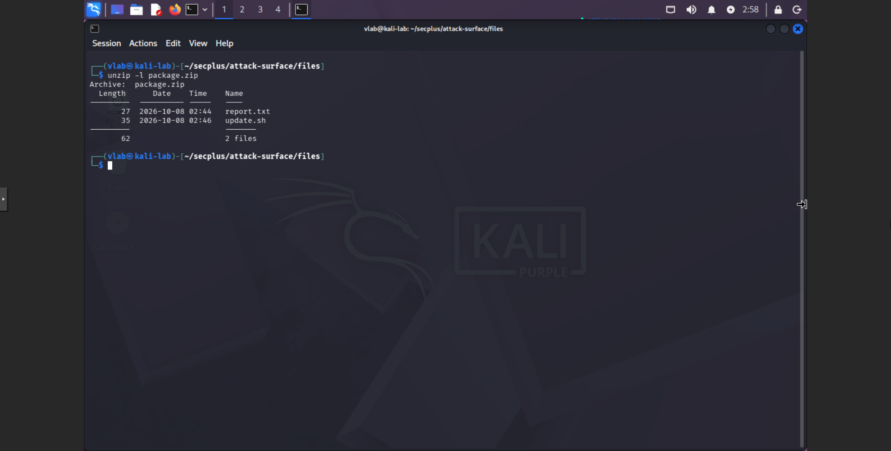

**Command:**

```bash
unzip -l package.zip
```

The listing contains `report.txt` at 27 bytes and `update.sh` at 35 bytes, for 62 uncompressed bytes across two files. The command lists archive contents; it does not extract or execute them.

### Step 3.6 - Inspect the script text without running it

Print the first 20 lines of the benign script for passive review.

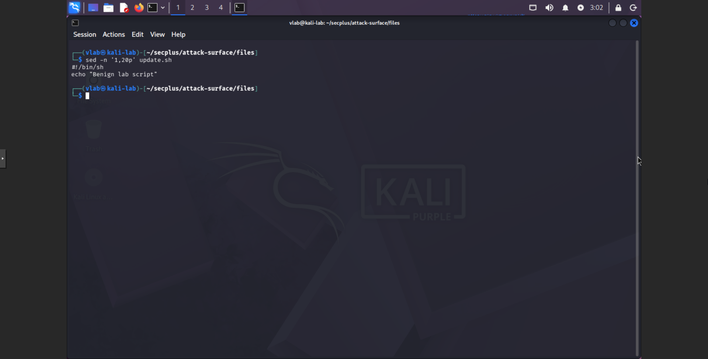

**Command:**

```bash
sed -n '1,20p' update.sh
```

The displayed text is:

```sh
#!/bin/sh
echo "Benign lab script"
```

`sed` reads and prints the file content; it does not run the script. This is a limited passive inspection, not dynamic malware analysis, and reading a script does not prove that an arbitrary script is safe.

This phase demonstrates a cautious sequence for benign sample files: identify their format, record fingerprints, inspect archive contents before extraction, and review script text without executing it.

## Observed Final State

- The baseline Ubuntu scan showed TCP/22 and TCP/80 open. After Nginx was stopped and disabled, Kali observed TCP/80 closed while TCP/22 remained open in the follow-up scan.
- The targeted Windows scan showed TCP/7680 open before the firewall rule and filtered afterward. Windows continued to show TCP/7680 in the `Listen` state under PID 5200, mapped to `DoSvc` / Delivery Optimization.
- The lab execution record reports that the temporary Windows firewall rule was removed and a subsequent `Get-NetFirewallRule` query found no matching rule. It also reports that Ubuntu Nginx was restored with `sudo systemctl enable --now nginx` and returned to enabled, active (running) status. The supplied screenshot set contains no separate cleanup capture, so these restoration results are noted without image evidence.
- The six simulated message cases were classified with decisive clues and safe responses; no real message, live link, or website was tested.
- `report.txt`, `update.sh`, and `package.zip` were created as benign lab samples. Their types and SHA-256 values were recorded, the ZIP was listed without extraction, and `update.sh` was reviewed without execution.

## Security+ Concept Mapping

| Lab evidence | Security+ concept | What the evidence demonstrates |
|---|---|---|
| Kali Nmap scans before and after the Ubuntu change | Network attack surface; open service ports | A service's network exposure can be observed from another host; an open port is not, by itself, proof of a vulnerability. |
| Ubuntu `ss` output compared with Kali scans | Local listeners vs. network reachability | A host-side listening socket and a remote scanner's port state describe different views. |
| Nginx shutdown and TCP/80 open-to-closed result | Service hardening; attack surface reduction | Stopping an unnecessary service removes its listener and changes the observed port state. |
| Windows listener and service mapping, firewall rule, and before/after scan | Firewall filtering; service identity | A port can remain locally listening while the tested remote path reports filtered; scanner service labels require host-side confirmation. |
| Six simulated message cases | Message-based, file-based, voice, and web/domain vectors; phishing and BEC | Channel, vector, technique, decisive clue, and safe action can be classified separately from scenario evidence. |
| `file`, `sha256sum`, `unzip -l`, and `sed` results | File-based vectors; passive inspection; integrity fingerprints | File format, recorded hash, archive contents, and visible script text can be reviewed without executing the sample. |

## Troubleshooting / Lessons Learned

- An initial duplicate-rule situation was resolved before final firewall validation. The README documents the final rule shown in the evidence rather than the intermediate state; the supplied screenshots do not show the duplicate entries or their cleanup command.
- `filtered` with `no-response` must not be reported as `closed` or attributed to a particular control based on that state alone.
- The `file` utility's `ASCII text executable` description is not a substitute for checking file permissions; `chmod 644` and `ls -l` show that the script execute bit was not set.

## Portfolio Summary

This lab documents network attack surface assessment from Kali, Ubuntu service shutdown, Windows service and firewall exposure checks, simulated phishing/BEC triage, and passive inspection of benign files. The findings are limited to the systems, ports, paths, sample files, and screenshots recorded here; they do not claim a full vulnerability assessment, real-world phishing response, or malware analysis.
